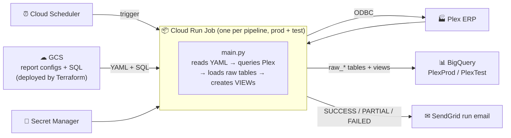

# Plex to BigQuery ETL Pipeline

Pulls operational data from **Plex ERP** over ODBC into **Google BigQuery**,
builds business-facing views on top, and emails a run report every time.
It runs as Cloud Run Jobs triggered by Cloud Scheduler; credentials live in
Secret Manager. What each pipeline extracts and the SQL of each view live in
Cloud Storage, deployed from this repo by Terraform.

**GCP project:** `voxdatalake` · **Datasets:** `PlexProd` (prod) / `PlexTest` (test)

**13 pipelines, 26 Cloud Run jobs (prod + test), about 68 BigQuery views.**
The pipelines are Sales Orders, Sales Quotes, Sales Returns, Work Orders,
Purchasing Open Orders, Purchasing Pending Requisitions, Part Obsolescence,
Inventory Activity, Inventory Snapshot, Part On-Hand Inventory, Quality
Non-Conformance, Quality Supplier Returns and Label Design. Every deployed
view has a business-facing doc:
[docs/reports/REPORT_CATALOG.md](docs/reports/REPORT_CATALOG.md).

---

## Three projects, one repo

| Project | What it is | Branch | Folder | Open with | Status lives in |
|---|---|---|---|---|---|
| **Vox Scorecard** | Plex views behind every tile of the Vox MTD scorecard; manual-data app for goals and safety | `dev-scorecard` | `ptbq-scorecard` | `scorecard.code-workspace` | [Migration Board](https://claude.ai/code/artifact/89e5211a-10c8-4a59-bf3d-c92f188c47a9) |
| **Scorecard Sandbox** | `voxdatalake.ScorecardSandbox`: a full simulated year under every tile, for designing Looker Studio | `dev-sandbox` | `ptbq-sandbox` | `sandbox-scorecard.code-workspace` | [findings](docs/SCORECARD_SANDBOX_FINDINGS.md) |
| **Label Design** | Plex → BigQuery → Monday.com artwork queue, plus an on-demand sync app | `dev-label-design` | `ptbq-label-design` | `label-design.code-workspace` | [label-design/STATUS.md](label-design/STATUS.md) |
| *Shared tooling* | `main.py`, Terraform structure, hooks, deploy scripts | `dev` | `ptbq-dev` | `dev-shared.code-workspace` | [CHANGELOG.md](CHANGELOG.md) |
| ***Deploy*** | merges and deploys only, no edits | `main` | `plex-to-big-query` | `main-deploy.code-workspace` | `git tag -l 'deploy/*'` |

Each project has **its own folder**, a git worktree bound to its branch, so
two sessions can never share a working tree. Git hooks and a guard *inside
Terraform* block the mistakes that happened on 2026-09-24: commits on the
wrong branch, commits mixing projects, and deploys from anywhere but `main`.

### The flow, at a glance

```
edit in the project's folder ─► commit on its dev branch ─► PR / merge into main
      (hooks check every commit)                                    │
                                                                    ▼
      re-sync every dev branch ◄── verify the view in BigQuery ◄── ./scripts/deploy.sh
          (git merge main)                                         (primary folder only)
```

- **Setup, every lock and its override, PRs, conflicts:**
  [CONTRIBUTING.md](CONTRIBUTING.md).
- **Every command on one page:** [docs/CHEATSHEET.md](docs/CHEATSHEET.md).

> **Not everything here comes from Plex.** Goals and safety incidents are
> typed by people into the **manual-data app** (`deploy/manual_data_app/`).
> Goals then reach every "% to goal" view through `scorecard_goals_resolved`:
> the app's newest entry wins, with the legacy `scorecard_goals` table as the
> fallback. See [docs/reports/scorecard_goals_resolved.md](docs/reports/scorecard_goals_resolved.md).

---

## How it works



- **Change a report's query or extraction:**
  1. edit `reports/…` on the project's branch;
  2. merge into `main`;
  3. deploy with `./scripts/deploy.sh`.

  No container rebuild is needed.
- **Change Python** (`main.py`, `email_utils.py`): same flow, then a Cloud
  Build image deploy (docs/OPERATIONS.md, Step 5).
- **Exit code 0 does not mean the view exists.** Query the view after a run
  (CLAUDE.md explains why).

---

## Read next

| You want to… | Go to |
|---|---|
| **See everything still open, all projects** | [docs/OPEN_ITEMS.md](docs/OPEN_ITEMS.md) |
| Find a command | [docs/CHEATSHEET.md](docs/CHEATSHEET.md) |
| Learn the workflow: folders, hooks, commits, PRs, deploy | [CONTRIBUTING.md](CONTRIBUTING.md) |
| Run it locally and get CSVs | [docs/LOCAL_SETUP.md](docs/LOCAL_SETUP.md), then [docs/QUICKSTART.md](docs/QUICKSTART.md) |
| Stand up GCP from zero | [docs/DEPLOYMENT_GUIDE.md](docs/DEPLOYMENT_GUIDE.md) |
| Edit or add a report; retries; SendGrid | [docs/OPERATIONS.md](docs/OPERATIONS.md) |
| Understand the data flow and config | [docs/TECHNICAL_REFERENCE.md](docs/TECHNICAL_REFERENCE.md) |
| Learn the stack as a frontend developer | [docs/FRONTEND_GUIDE.md](docs/FRONTEND_GUIDE.md) |
| Look up gcloud / docker / terraform detail | [docs/API_REFERENCE.md](docs/API_REFERENCE.md) |
| Fix an error | [docs/TROUBLESHOOTING.md](docs/TROUBLESHOOTING.md) |
| See when each job runs and emails | [docs/EMAIL_SCHEDULE.md](docs/EMAIL_SCHEDULE.md) |
| Know what a report means for the business | [docs/reports/REPORT_CATALOG.md](docs/reports/REPORT_CATALOG.md) |
| Look up a Plex field | [docs/PLEX_GLOSSARY.md](docs/PLEX_GLOSSARY.md), [catalog/plex_catalog_index.md](catalog/plex_catalog_index.md) |
| Understand the scorecard, tile by tile | [Scorecard Field Manual](https://claude.ai/code/artifact/2e629322-e24f-4402-87bd-77217143011a) |
| Recover from a lost project, or tear down | [docs/DISASTER_RECOVERY.md](docs/DISASTER_RECOVERY.md), [docs/TEARDOWN.md](docs/TEARDOWN.md) |
| Know why something is the way it is | [CHANGELOG.md](CHANGELOG.md), newest first |
| Read finished work: code review, driver license, NetSuite parity | [docs/archive/](docs/archive/) |

---

## Repository layout

| Path | Purpose | Project |
|---|---|---|
| `main.py`, `email_utils.py`, `templates/` | ETL engine and the run email | shared |
| `reports/*.yaml`, `reports/test/*.yaml` | Per-pipeline extractions and views; prod and test are **separate, hand-kept** files | shared |
| `reports/sql/*.sql` | One file per BigQuery view (used by prod and test) | shared |
| `terraform/` | All GCP infrastructure, including the deploy guard | shared |
| `deploy/cloudbuild.yaml` | Image build and deploy to all 26 jobs | shared |
| `.githooks/`, `scripts/deploy.sh`, `scripts/tf_guard.py`, `scripts/plan_review.py` | The locks, and the only way to deploy | shared |
| `deploy/manual_data_app/`, `scripts/board/`, `score-card-reference/` | Manual-data web app, Migration Board generator, Vox source material | Scorecard |
| `scripts/scorecard_sandbox/`, `docs/SCORECARD_SANDBOX_FINDINGS.md` | Sandbox build and what it found | Sandbox |
| `label-design/`, `label_design_service/`, `deploy/label_design_sync/`, `deploy/label_design_trigger/` | Label Design status, push service, sheet sync, on-demand app | Label Design |
| `docs/` | Guides; `docs/reports/` holds the business docs; `docs/archive/` holds finished history | shared |
| `reports-list/`, `spreadsheets/` | Company report inventory and the Google Sheets being mapped, with status per row | shared |
| `catalog/`, `mapping/` | Plex ODBC schema catalogs; NetSuite ↔ Plex mapping | shared |
| `*.code-workspace` | One VS Code workspace per project folder | shared |
| `driver/`, `output/`, `.env`, `terraform/terraform.tfvars` | Gitignored: ODBC driver, local CSVs, secrets, Terraform variables (primary folder only) | — |

## First run on a new machine

```bash
git clone https://github.com/Parasol-Group-Inc/plex-to-big-query.git C:/F/Parasol/plex-to-big-query
cd C:/F/Parasol/plex-to-big-query
./scripts/install_hooks.sh                       # once per clone
git worktree add ../ptbq-scorecard dev-scorecard  # one folder per project
git worktree add ../ptbq-sandbox dev-sandbox
git worktree add ../ptbq-label-design dev-label-design
git worktree add ../ptbq-dev dev
cp .env.example .env && docker compose build && docker compose up   # local, read-only health check
```

`terraform/terraform.tfvars` goes in the primary folder only; that is
where deploys happen. Full local setup:
[docs/LOCAL_SETUP.md](docs/LOCAL_SETUP.md). GCP from zero:
[docs/DEPLOYMENT_GUIDE.md](docs/DEPLOYMENT_GUIDE.md).
