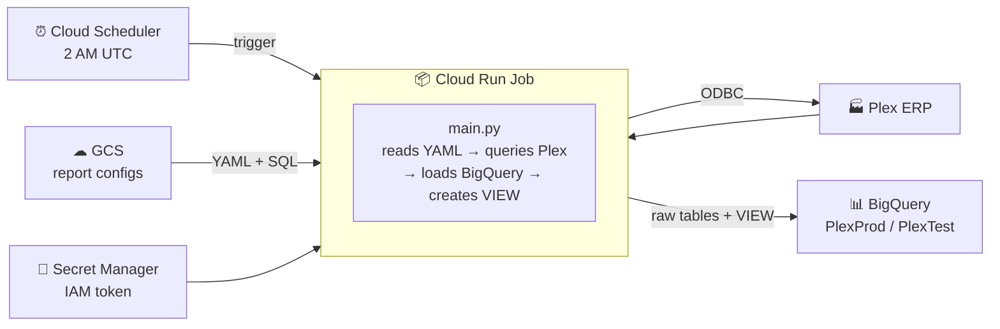

# Plex to BigQuery ETL Pipeline

Pulls operational data from **Plex ERP** via ODBC and loads it into **Google BigQuery** on a scheduled basis. Runs as a Cloud Run Job triggered daily by Cloud Scheduler. Credentials are stored in Secret Manager. Report definitions (which views to pull, with what filters, and how to JOIN the data) live in **Cloud Storage** and can be edited without rebuilding the container.

**GCP project:** `voxdatalake` | **Datasets:** `PlexProd` (prod) `PlexTest` (test) | **Active report:** sales orders (13 Plex views → `sales_orders_report` BigQuery view)

---

## How it works



**To change a report query:** edit `reports/sales_orders.yaml` and push to GCS — no container rebuild, no Terraform apply.

**To add a new report:** create a new YAML in GCS, add one Cloud Run Job in Terraform.

---

## Quick navigation

| What you want to do | Where to look |
|---|---|
| **Quick reference — everything on one page** | [CHEATSHEET.md](CHEATSHEET.md) ← start here |
| New here? Step-by-step guide | [docs/QUICKSTART.md](docs/QUICKSTART.md) |
| Frontend dev learning the stack | [docs/FRONTEND_GUIDE.md](docs/FRONTEND_GUIDE.md) |
| Run locally and get CSV output | [LOCAL_SETUP.md](LOCAL_SETUP.md) |
| Deploy to GCP with Terraform | [DEPLOYMENT_GUIDE.md](DEPLOYMENT_GUIDE.md) |
| Understand the data flow and config | [TECHNICAL_REFERENCE.md](TECHNICAL_REFERENCE.md) |
| Edit reports, add new reports, SendGrid | [docs/OPERATIONS.md](docs/OPERATIONS.md) |
| All Plex ODBC views by database | [docs/plex_catalog_index.md](docs/plex_catalog_index.md) |
| gcloud / docker / terraform commands | [docs/API_REFERENCE.md](docs/API_REFERENCE.md) |
| Tear down all GCP infrastructure | [docs/TEARDOWN.md](docs/TEARDOWN.md) |
| Fix errors (copy-paste commands) | [docs/TROUBLESHOOTING.md](docs/TROUBLESHOOTING.md) |
| Request ODBC access from Plex support | [PLEX_SUPPORT_TEMPLATE.md](PLEX_SUPPORT_TEMPLATE.md) |

---

## Repository layout

| Path | Purpose |
|---|---|
| `main.py` | ETL entry point — loads GCS config, loops Plex extractions, creates BigQuery VIEW |
| `email_utils.py` | SendGrid email report builder |
| `requirements.txt` | Python dependencies (pinned) |
| `Dockerfile` | Container image — installs Plex ODBC driver and Python app |
| `docker-compose.yml` | Local Phase 1 runner — builds image, writes CSVs to `./output/` |
| `.env.example` | Template for your `.env` file — copy and fill in |
| `config/odbcinst.ini` | Registers the Plex ODBC driver with unixODBC |
| `config/odbc.ini` | Defines PlexProduction and PlexTest DSNs (host, port) |
| `templates/report.html` | HTML template for email run summaries |
| `driver/` | Plex Linux ODBC driver files — gitignored, must be populated manually |
| **`reports/`** | **Report definitions — edit to change what the pipeline extracts** |
| `reports/sales_orders.yaml` | Prod report: 13 Plex views → `PlexProd` |
| `reports/test/sales_orders.yaml` | Test report: same views → `PlexTest` |
| `reports/sql/sales_orders_view.sql` | BigQuery JOIN SQL for the 16-field sales orders report |
| `terraform/main.tf` | All GCP infrastructure as code |
| `terraform/variables.tf` | Terraform input variable definitions |
| `terraform/outputs.tf` | Terraform outputs — copy-paste commands after apply |
| `terraform/terraform.tfvars.example` | Template for your `terraform.tfvars` file |
| `deploy/cloudbuild.yaml` | Cloud Build CI/CD pipeline definition |
| `CHEATSHEET.md` | Quick reference — architecture, commands, troubleshooting, GCP fundamentals |
| `docs/QUICKSTART.md` | Step-by-step setup guide, no prior knowledge assumed |
| `docs/FRONTEND_GUIDE.md` | Architecture study guide with diagrams, written for frontend devs |
| `docs/API_REFERENCE.md` | All gcloud, docker, terraform, and bq commands for this project |
| `docs/OPERATIONS.md` | Edit reports, add new reports, configure SendGrid |
| `docs/TROUBLESHOOTING.md` | Copy-paste fixes for every common error |
| `docs/plex_catalog_index.md` | Master index of all Plex ODBC views across all databases |
| `output/` | CSV files written by local runs — gitignored |

---

## Two-phase setup

**Phase 1** — get local extraction working:
```bash
cp .env.example .env        # fill in Plex credentials and IAM token
docker compose build
docker compose up
# inspect ./output/*.csv
```

**Phase 2** — deploy to GCP once extraction is verified:
```bash
cd terraform
cp terraform.tfvars.example terraform.tfvars   # fill in GCP project details
terraform init && terraform apply -var-file=terraform.tfvars
# push Docker image, add secret versions, trigger job
```

Full step-by-step in [docs/QUICKSTART.md](docs/QUICKSTART.md) or the individual guides above.

---

## Current status

| Component | State |
|---|---|
| Local Docker extraction | ✅ Working — `vox.test.odbc.plex.com`, IAM token auth |
| GCP infrastructure | ✅ Deployed — `voxdatalake`, Terraform-managed |
| Cloud Run image | ✅ Pushed — `us-central1-docker.pkg.dev/voxdatalake/plex-pipeline/etl:latest` |
| Multi-report GCS architecture | ✅ Live — YAML + SQL in GCS, editable without any deployment |
| Sales Orders — test (`PlexTest`) | ✅ Validated — all 13 raw tables + `sales_orders_report` VIEW confirmed |
| Sales Orders — prod (`PlexProd`) | ✅ Ready — `vox.odbc.plex.com` confirmed, trigger `plex-etl` to go live |
| Sales Orders VIEW (16-field) | ✅ All columns verified against live Plex data |
| Work Orders — infra | ✅ Deployed — `plex-etl-work-orders` + `plex-etl-work-orders-test` |
| Work Orders — data | ✅ First run complete — Workcenter data confirmed; Job/Job_Op rows pending prod data |
| DataDirect ODBC license | ⚠ Trial — resolve before production cutover |
