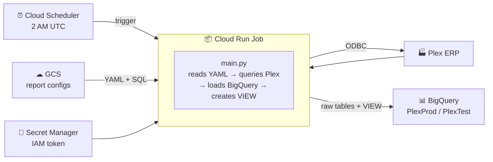

# Plex to BigQuery ETL Pipeline

Pulls operational data from **Plex ERP** via ODBC and loads it into **Google BigQuery** on a daily schedule. Runs as Cloud Run Jobs triggered by Cloud Scheduler; credentials live in Secret Manager. Report definitions (which views to pull, filters, JOIN logic) live in **Cloud Storage** and can be edited without rebuilding the container.

**GCP project:** `voxdatalake` | **Datasets:** `PlexProd` (prod) / `PlexTest` (test) | **Active reports:** Sales Orders, Work Orders

---

## How it works



- **Change a report query:** edit the YAML or SQL in GCS — no rebuild, no Terraform.
- **Add a new report:** new YAML + SQL in GCS, one Cloud Run Job block in Terraform.
- **After every run:** an HTML email report (SUCCESS / PARTIAL / FAILED) goes out via SendGrid.

---

## Quick navigation

| What you want to do | Where to look |
|---|---|
| **Quick reference — everything on one page** | [CHEATSHEET.md](CHEATSHEET.md) ← start here |
| New here? Step-by-step guide | [docs/QUICKSTART.md](docs/QUICKSTART.md) |
| Frontend dev learning the stack | [docs/FRONTEND_GUIDE.md](docs/FRONTEND_GUIDE.md) |
| Run locally and get CSV output | [LOCAL_SETUP.md](LOCAL_SETUP.md) |
| Deploy to GCP with Terraform | [DEPLOYMENT_GUIDE.md](DEPLOYMENT_GUIDE.md) |
| Understand the data flow and config | [TECHNICAL_REFERENCE.md](TECHNICAL_REFERENCE.md) |
| Edit reports, add new reports, SendGrid | [docs/OPERATIONS.md](docs/OPERATIONS.md) |
| Browse all Plex ODBC views by database | [catalog/plex_catalog_index.md](catalog/plex_catalog_index.md) |
| gcloud / docker / terraform commands | [docs/API_REFERENCE.md](docs/API_REFERENCE.md) |
| Fix errors (copy-paste commands) | [docs/TROUBLESHOOTING.md](docs/TROUBLESHOOTING.md) |
| Code review findings + safety guards | [docs/CODE_REVIEW_2026-07-14.md](docs/CODE_REVIEW_2026-07-14.md) |
| Tear down all GCP infrastructure | [docs/TEARDOWN.md](docs/TEARDOWN.md) |
| Request ODBC access from Plex support | [PLEX_SUPPORT_TEMPLATE.md](PLEX_SUPPORT_TEMPLATE.md) |

---

## Repository layout

| Path | Purpose |
|---|---|
| `main.py` | ETL entry point — loads GCS config, loops Plex extractions, creates BigQuery VIEW |
| `email_utils.py` | SendGrid email report builder |
| `templates/report.html` | HTML template for email run summaries |
| **`reports/`** | **Report definitions — edit to change what the pipeline extracts** |
| `reports/*.yaml` | Prod report configs (sales_orders, work_orders) |
| `reports/test/*.yaml` | Test report configs (same views → `PlexTest`) |
| `reports/sql/*.sql` | BigQuery JOIN SQL — one file per report view |
| `terraform/` | All GCP infrastructure as code (jobs, schedulers, buckets, IAM) |
| `deploy/cloudbuild.yaml` | CI/CD — build, push, deploy, smoke-test (test job only) |
| `Dockerfile` / `docker-compose.yml` | Container image + local Phase-1 runner |
| `config/` | ODBC driver registration (`odbcinst.ini`) and DSNs (`odbc.ini`) |
| `driver/` | Plex Linux ODBC driver files — gitignored, fetched from GCS in CI |
| `docs/` | Guides: quickstart, operations, troubleshooting, API reference, code review |
| `catalog/` | Plex ODBC view catalogs — reference data, one file per Plex database |
| `output/` | CSV files from local runs — gitignored |

---

## Two-phase setup

**Phase 1** — get local extraction working:
```bash
cp .env.example .env        # fill in Plex credentials and IAM token
docker compose build
docker compose up
# inspect ./output/*.csv
```

**Phase 2** — deploy to GCP once extraction is verified:
```bash
cd terraform
cp terraform.tfvars.example terraform.tfvars   # fill in GCP project details
terraform init && terraform apply -var-file=terraform.tfvars
# push Docker image, add secret versions, trigger job
```

Full step-by-step in [docs/QUICKSTART.md](docs/QUICKSTART.md).

---

## Current status

| Component | State |
|---|---|
| GCP infrastructure | ✅ Deployed — `voxdatalake`, Terraform-managed |
| Multi-report GCS architecture | ✅ Live — YAML + SQL in GCS, editable without any deployment |
| Sales Orders — test | ✅ Live and verified — 16-field view, dates confirmed as real DATEs (2026-07-15) |
| Sales Orders — prod | 🔴 **Failing since 2026-07-19** — ODBC error 2404 "Session refused by service" |
| Work Orders (prod + test) | ✅ Live — test data fully confirmed; prod `Job`/`Job_Op` still empty on the Plex side |
| Code review (2026-07-14) | ✅ All findings fixed and verified — [docs/CODE_REVIEW_2026-07-14.md](docs/CODE_REVIEW_2026-07-14.md) |
| DataDirect ODBC license | 🔴 Driver has been running **unlicensed** the whole time (installer never ran) — real license found, apply-steps: [docs/APPLY_DRIVER_LICENSE.md](docs/APPLY_DRIVER_LICENSE.md). If that doesn't fix the prod outage above: [PLEX_SUPPORT_FOLLOWUP_PROD_SESSION.md](PLEX_SUPPORT_FOLLOWUP_PROD_SESSION.md) |
| SendGrid domain auth | ⚠ Pending — Gmail shows "couldn't verify" on report emails until CNAME records added |
