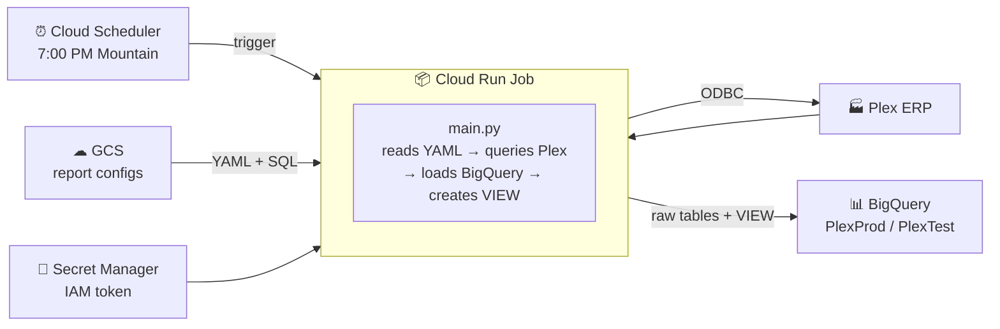

# Plex to BigQuery ETL Pipeline

Pulls operational data from **Plex ERP** via ODBC and loads it into **Google BigQuery** on a daily schedule. Runs as Cloud Run Jobs triggered by Cloud Scheduler; credentials live in Secret Manager. Report definitions (which views to pull, filters, JOIN logic) live in **Cloud Storage** and can be edited without rebuilding the container.

**GCP project:** `voxdatalake` | **Datasets:** `PlexProd` (prod) / `PlexTest` (test)

**12 report families** (24 Cloud Run jobs, prod + test): Sales Orders, Sales Quotes, Sales Returns, Work Orders, Purchasing Open Orders, Purchasing Pending Requisitions, Part Obsolescence, Inventory Activity, Inventory Snapshot, Part On-Hand Inventory, Quality Non-Conformance, Quality Supplier Returns — producing ~60 BigQuery views. Full list: [docs/reports/REPORT_CATALOG.md](docs/reports/REPORT_CATALOG.md).

> **One table here isn't from Plex.** `scorecard_goals` holds the negotiated targets behind every "% to Goal" tile. It's fed from a Google Sheet by an Apps Script (`deploy/goals_sheet_to_bigquery.gs`), is not managed by Terraform, and is not created by the ETL — but three views read it. See [docs/reports/scorecard_goals.md](docs/reports/scorecard_goals.md).

> **One pipeline here isn't a scorecard report.** `label_design` is a Plex → BigQuery → Google Sheet → Monday.com operational queue (replacing a twice-daily manual NetSuite loop), unrelated to the Vox Nutrition scorecard work the rest of this repo tracks. It has its own hub: [label-design/README.md](label-design/README.md), and its own status file at [label-design/STATUS.md](label-design/STATUS.md) (not the Scorecard's [Migration Board](https://claude.ai/code/artifact/89e5211a-10c8-4a59-bf3d-c92f188c47a9) — keep these two separate, that's the whole point of this split).
>
> **Working on one project at a time?** Open `scorecard.code-workspace` or `label-design.code-workspace` instead of the repo folder directly — same single repo, same git history, just VS Code's explorer/search filtered to hide the other project's exclusive folders so the two don't bleed into each other while you work.

---

## Learning this project

Three places, in the order you'd want them:

| | |
|---|---|
| **[Scorecard Field Manual](https://claude.ai/code/artifact/2e629322-e24f-4402-87bd-77217143011a)** | Every tile taken apart — its Plex source, why it is built that way, what might not be true. Written to answer *"where is that used?"* and *"why do we need it at all?"* Includes a searchable glossary. |
| **[Vox Migration Board](https://claude.ai/code/artifact/89e5211a-10c8-4a59-bf3d-c92f188c47a9)** | Live status per tile, and the decisions still open. Shared with Vox. |
| **[`docs/PLEX_GLOSSARY.md`](docs/PLEX_GLOSSARY.md)** | Plex's own definitions for the fields this repo reads — 93 of its 61,022 entries, cut down by `scripts/distill_glossary.py`. |

Then `docs/CHEATSHEET.md` for the pipeline mechanics, and `CHANGELOG.md` for
why anything is the way it is.

## How it works



- **Change a report query:** edit the YAML or SQL in GCS — no rebuild, no Terraform.
- **Add a new report:** new YAML + SQL in GCS, one Cloud Run Job block in Terraform.
- **After every run:** an HTML email report (SUCCESS / PARTIAL / FAILED) goes out via SendGrid.

---

## Branch workflow

`main` is the only branch anything ever gets deployed from — but nothing
technical enforces that: `terraform apply` and `gcloud builds submit` both
deploy whatever's on local disk, regardless of branch. Work happens on one
of three long-running branches instead of `main` directly:

| Project | Branch | Folder | Workspace |
|---|---|---|---|
| Deploy only | `main` | `plex-to-big-query` | `main-deploy.code-workspace` |
| Vox Scorecard | `dev-scorecard` | `ptbq-scorecard` | `scorecard.code-workspace` |
| Scorecard Sandbox | `dev-sandbox` | `ptbq-sandbox` | `sandbox-scorecard.code-workspace` |
| Label Design | `dev-label-design` | `ptbq-label-design` | `label-design.code-workspace` |
| Shared tooling | `dev` | `ptbq-dev` | `dev-shared.code-workspace` |

Each project has **its own folder** (a git worktree bound to its branch), and
**versioned hooks plus a Terraform guard** block the mistakes that happened on
2026-09-24: wrong-branch commits, cross-project commits, and applies from
anywhere but `main`. Deploy with **`./scripts/deploy.sh`** from the primary
folder. Setup, every lock and its override, and the full change → main →
deploy flow: [CONTRIBUTING.md](CONTRIBUTING.md#branches-folders-and-locks--main-is-prod-work-happens-on-dev).

---

## Quick navigation

| What you want to do | Where to look |
|---|---|
| **Quick reference — everything on one page** | [CHEATSHEET.md](docs/CHEATSHEET.md) ← start here |
| New here? Step-by-step guide | [docs/QUICKSTART.md](docs/QUICKSTART.md) |
| Frontend dev learning the stack | [docs/FRONTEND_GUIDE.md](docs/FRONTEND_GUIDE.md) |
| Run locally and get CSV output | [LOCAL_SETUP.md](docs/LOCAL_SETUP.md) |
| Deploy to GCP with Terraform | [DEPLOYMENT_GUIDE.md](docs/DEPLOYMENT_GUIDE.md) |
| Understand the data flow and config | [TECHNICAL_REFERENCE.md](docs/TECHNICAL_REFERENCE.md) |
| Edit reports, add new reports, SendGrid | [docs/OPERATIONS.md](docs/OPERATIONS.md) |
| Browse all Plex ODBC views by database | [catalog/plex_catalog_index.md](catalog/plex_catalog_index.md) |
| gcloud / docker / terraform commands | [docs/API_REFERENCE.md](docs/API_REFERENCE.md) |
| Fix errors (copy-paste commands) | [docs/TROUBLESHOOTING.md](docs/TROUBLESHOOTING.md) |
| Code review findings + safety guards | [docs/CODE_REVIEW_2026-07-14.md](docs/CODE_REVIEW_2026-07-14.md) |
| What if the GCP account/project is lost? | [docs/DISASTER_RECOVERY.md](docs/DISASTER_RECOVERY.md) |
| Tear down all GCP infrastructure | [docs/TEARDOWN.md](docs/TEARDOWN.md) |

---

## Repository layout

| Path | Purpose |
|---|---|
| `main.py` | ETL entry point — loads GCS config, loops Plex extractions, creates BigQuery VIEW |
| `email_utils.py` | SendGrid email report builder |
| `templates/report.html` | HTML template for email run summaries |
| **`reports/`** | **Report definitions — edit to change what the pipeline extracts** |
| `reports/*.yaml` | Prod report configs — one per pipeline, 12 of them |
| `reports/test/*.yaml` | Test report configs (same views → `PlexTest`) |
| `reports/sql/*.sql` | BigQuery JOIN SQL — one file per report view |
| `terraform/` | All GCP infrastructure as code (jobs, schedulers, buckets, IAM) |
| `deploy/cloudbuild.yaml` | CI/CD — build, push, deploy, smoke-test (test job only) |
| `Dockerfile` / `docker-compose.yml` | Container image + local Phase-1 runner |
| `config/` | ODBC driver registration (`odbcinst.ini`) and DSNs (`odbc.ini`) |
| `driver/` | Plex Linux ODBC driver files — gitignored, fetched from GCS in CI |
| `docs/` | Guides: quickstart, operations, troubleshooting, API reference, code review |
| `catalog/` | Plex ODBC view catalogs — reference data, one file per Plex database |
| `output/` | CSV files from local runs — gitignored |

---

## Two-phase setup

**Phase 1** — get local extraction working:
```bash
cp .env.example .env        # fill in Plex credentials and IAM token
docker compose build
docker compose up
# inspect ./output/*.csv
```

**Phase 2** — deploy to GCP once extraction is verified:
```bash
cd terraform
cp terraform.tfvars.example terraform.tfvars   # fill in GCP project details
terraform init && terraform apply -var-file=terraform.tfvars
# push Docker image, add secret versions, trigger job
```

Full step-by-step in [docs/QUICKSTART.md](docs/QUICKSTART.md).

---

## Current status

| Component | State |
|---|---|
| GCP infrastructure | ✅ Deployed — `voxdatalake`, Terraform-managed |
| Multi-report GCS architecture | ✅ Live — YAML + SQL in GCS, editable without any deployment |
| Sales Orders — test | ✅ Live and verified — 16-field view, dates confirmed as real DATEs (2026-07-15) |
| Sales Orders — prod | ✅ Resolved (2026-07-20) — was failing with ODBC error 2404 "Session refused by service"; confirmed a Plex-side account restriction (not our driver/license/code), fixed by Plex Support |
| Work Orders (prod + test) | ✅ Live — test data confirmed; prod still empty on the Plex side (Vox has not gone live) |
| Code review (2026-07-14) | ✅ All findings fixed and verified — [docs/CODE_REVIEW_2026-07-14.md](docs/CODE_REVIEW_2026-07-14.md) |
| DataDirect ODBC license | ✅ Applied (driver was running unlicensed — see [docs/APPLY_DRIVER_LICENSE.md](docs/APPLY_DRIVER_LICENSE.md)) |
| Terraform state | ✅ Migrated to shared GCS backend (2026-07-20) — any team member with access can safely run `plan`/`apply`, no longer tied to one machine |
| Team readiness | ✅ Audited (2026-07-20) — stale project/host/dataset references across 6 docs fixed; see [docs/CLICKUP_TEAM_GUIDE.md](docs/CLICKUP_TEAM_GUIDE.md) |
| Vox scorecard migration | 🛠 In progress — 31 of 37 tiles have a BigQuery view; `PlexProd` still empty pending go-live. See [score-card-reference/VOX_SCORECARD_PLEX_MIGRATION_MAP.md](score-card-reference/VOX_SCORECARD_PLEX_MIGRATION_MAP.md) |
| SendGrid domain auth | ✅ Resolved 2026-08-21 — CNAME records added, no more "couldn't verify" warning |
