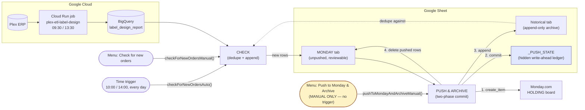
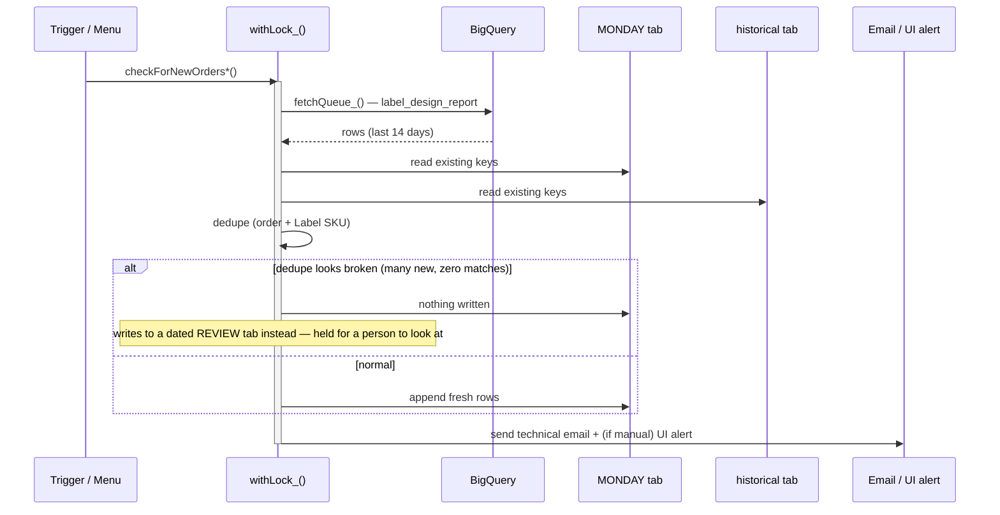
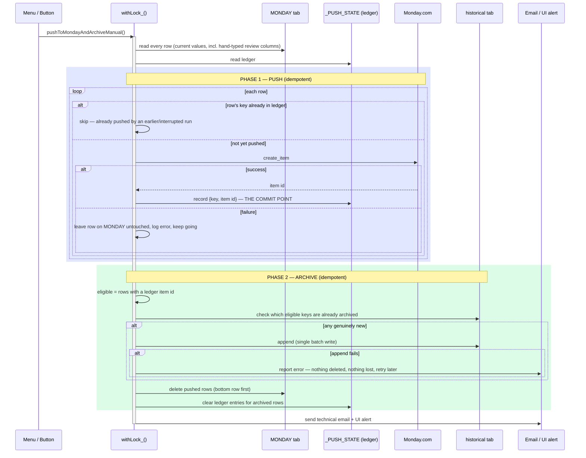
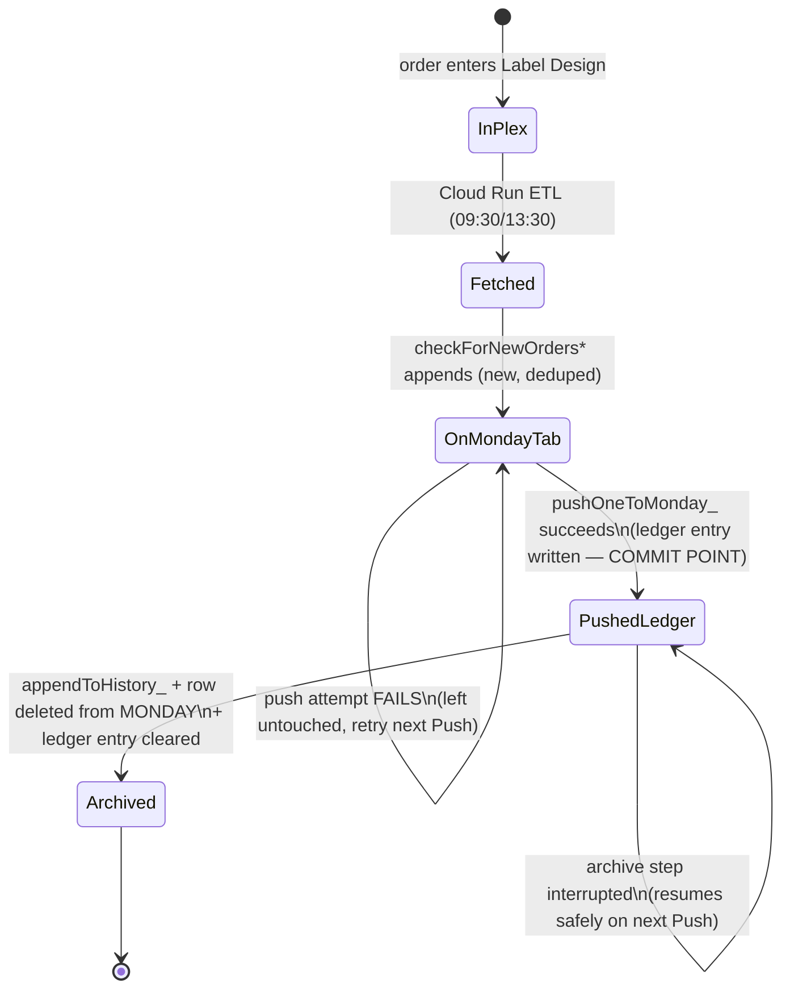

# Label Design sync — BigQuery → Sheet → Monday

> **Being retired (2026-09-25).** This describes the Sheet-based flow, which the push service (`label_design_service/push.py`) replaces once it is scheduled in prod. It stays accurate for the Apps Script that is still live until then. Current status: [`label-design/STATUS.md`](../../label-design/STATUS.md).

> **Looking for the plain-English "how do I use the two buttons" guide
> instead?** See [TEAM_GUIDE.md](./TEAM_GUIDE.md). This document is the
> technical design/reference.

Replaces a twice-daily manual loop: download a report from NetSuite, paste it
into a Google Sheet, check it for duplicates by hand, upload the new rows to
Monday.

```
Plex ──► label_design_report ──► [Check] ──► Sheet (MONDAY tab) ──► [Push] ──► Monday HOLDING board
 (Cloud Run job, 09:30/13:30)                                          │              +
                                                                        └──► Sheet (historical tab)
```

The Cloud Run job refreshes BigQuery. From there the work is **two separate,
independently-triggered steps**, not one:

1. **Check for new orders** — reads BigQuery, dedupes against what's already
   on the sheet, appends anything new to the `MONDAY` tab. **Never touches
   Monday.com. Never touches `historical`.** Runs automatically twice a day,
   and can also be run on demand from the sheet's menu.
2. **Push to Monday & Archive** — reads the `MONDAY` tab as it stands *right
   now* (including anything a person has typed into the review columns),
   creates one Monday item per row, then moves each successfully-pushed row
   into `historical` and clears it off `MONDAY`. **Manual only — there is no
   trigger for this step.**

Splitting these apart is the whole point of this revision. Under the old
single-step design, pushing to Monday happened automatically, straight from
the BigQuery snapshot — before anyone had a chance to fill in *Reason Code*,
*Label*, *Bottle Material*, *Prop 65* or *LCR*. Those columns exist on the
board for a reason; the only way they reach it is if a human reviews the row
on the sheet **before** it's pushed. Now that review window is real: rows sit
on `MONDAY` until someone presses the second button.

## Why this needed bank-grade handling

Push & Archive has **two side effects that cannot be one atomic operation**:
create an item on Monday.com (an external system, over HTTP, that can time
out on our side after it already succeeded on theirs), and rewrite two tabs in
the same spreadsheet (append to `historical`, delete from `MONDAY`). There is
no database transaction wrapping "call an external API" and "edit two ranges
of a Google Sheet" together — so the code has to be built so that **being
interrupted at any point between those steps never loses a row and never
silently double-creates one.**

The design borrows the two ideas that make bank transfers safe under the same
constraint:

- **A write-ahead ledger (`_PUSH_STATE`) is the single commit point.** A row
  is "pushed" the instant its Monday item is created — recorded in the ledger
  immediately, before anything else happens to that row. Everything before
  that write is safe to redo from scratch; everything after it must never
  repeat the push, only finish the archive.
- **A lock serializes every entry point.** Check, Push, and the scheduled
  trigger can never run at the same time as each other — `LockService`
  ensures only one is ever touching the sheet at once, so there is no
  "someone clicked Push while the Check trigger was mid-write" race to reason
  about at all.
- **Every step is idempotent.** Pressing Push twice in a row (or a run getting
  interrupted and retried) is safe: a row already in the ledger is not pushed
  again; a row already on `historical` is not archived again. The button can
  always be pressed again to "finish the job" rather than needing careful
  manual cleanup.
- **On any failure, the system prefers a duplicate over a loss.** If something
  goes wrong partway through, the worst case is a row that ends up on *both*
  `historical` and `MONDAY` a little longer than it should (visible, easy to
  spot, easy to fix) — never a row that vanishes from every tab and the
  board.

## The two buttons

Both live in the **"Label Design Sync"** custom menu, which the sheet builds
itself every time it's opened (`onOpen()` — no setup step needed, it just
appears):

| Menu item | Function | Also runs automatically? |
|---|---|---|
| 1) Check for new orders | `checkForNewOrdersManual` | Yes — `checkForNewOrdersAuto`, 10:00 & 14:00, every day |
| 2) Push to Monday & Archive | `pushToMondayAndArchiveManual` | **No — manual only, by design** |
| Dry run (read-only, logs only) | `testReadOnly` | No |

Each shows an on-screen summary (`ui.alert`) as well as sending its usual
technical email, so whoever clicked it doesn't have to wait on an inbox to
know what happened.

> A literal on-sheet Drawing/button can be pointed at either function too, if
> the team wants something more clickable than a menu — **Insert → Drawing**,
> then right-click it → **Assign script** → `checkForNewOrdersManual` or
> `pushToMondayAndArchiveManual`. The menu is documented as the primary,
> guaranteed mechanism because a Drawing can be deleted, copied without its
> assignment, or hidden by accident; the menu rebuilds itself every time the
> sheet opens and cannot go stale.

### System overview



## Check for new orders

Unchanged from before, in substance: fetch → dedupe against **both** tabs →
append fresh rows to `MONDAY` (or a dated `REVIEW <date>` tab, if the dedupe
key looks broken — see **Deduplication** below). What changed is simply that
it **stops there** — it used to call straight through to Monday; now it never
does.



**Note what it does *not* do:** it never pushes to Monday and never writes
`historical`. A busy Check run just means more rows waiting on `MONDAY` for
someone to review and then press Push.

## Push to Monday & Archive

The whole point of this rewrite. Reads `MONDAY` **as it currently stands** —
so Reason Code, Label, Bottle Material, Prop 65 and LCR, if a person has typed
them in during review, go to Monday too (previously they never did, because
the automatic push used the original BigQuery row, on which those columns
never had a value at all).



### What is guaranteed at each moment

| If interrupted... | What's true afterward | What pressing Push again does |
|---|---|---|
| Before any `create_item` call | Nothing changed. | Starts clean. |
| After `create_item` succeeds, before the ledger write | **Only real risk window.** Monday has the item; we don't know it yet. | Re-push would create a duplicate item (see *Known limitation* below) — rare, given normal latency. |
| After the ledger write, before archiving | Row has a Monday item, ledger entry, still on `MONDAY`, not yet on `historical`. | Resumes: sees the ledger entry, skips the push, proceeds straight to archiving. |
| After `historical` append, before `MONDAY` delete | Row is on **both** `historical` and `MONDAY`. | Sees the key already on `historical`, does **not** archive it again, but does delete it off `MONDAY` — self-heals to the correct end state. |
| After `MONDAY` delete, before ledger clear | Row is correctly archived; a stale ledger entry remains. | Harmless — the ledger entry for a key no longer on `MONDAY` is simply never looked at again. It does not cause a re-push (nothing on `MONDAY` matches it) or a re-archive (nothing on `MONDAY` matches it there either). |

In every case, the failure mode leans toward **"visible duplicate, easy to
spot and delete"** rather than **"row is gone"**.

### Per-row lifecycle



### Known, accepted limitation

If `UrlFetchApp.fetch()` to Monday **times out on our side after Monday has
already created the item**, the ledger write never happens, so a later Push
run sees no ledger entry for that key and will create a **second** item on
Monday. Monday.com has no idempotency-key / "create if not exists" mechanism
on `create_item`, so this cannot be fully closed from our side.

This is judged an acceptable, rare risk given normal latency and daily order
volume — and it fails in the "visible duplicate on the board" direction, not
the "silently lost" direction. If it's ever suspected, the remediation is
manual: find and delete the duplicate item on the Monday board.

## Historical tab — the rule, revised

Previously: **read and never written**, full stop.

Now: **append-only, exactly once per row, through exactly one function**
(`appendToHistory_()`), called from exactly one place
(`pushToMondayAndArchive_()`), and only for rows the ledger has already
confirmed were successfully pushed to Monday. Nothing already on the tab is
ever read back, edited, or reordered by this script — a note typed in two
years ago is never touched.

This is still **enforced, not just remembered**: every *other* write path in
the file goes through `assertNotHistory_()`, exactly as before, so a future
edit elsewhere in the script cannot accidentally start writing `historical`.
`appendToHistory_()` is a deliberate, documented, narrow exception to that
guard — not a change to the guard itself.

If the archive tab is missing, or lacks its key columns, at Check time the
run **stops** (unchanged) — without it nothing can be deduplicated. At Push
time, if the archive tab is missing or unreadable, the archive phase is
skipped with an error and **nothing is deleted from `MONDAY`** — pushed rows
stay exactly where they are rather than being archived blind.

## The sheet

**`SHEET_MAP` in `Code.gs` is the MONDAY tab's real header row, in its real
order.** Rows are written by looking up each column's position *on the tab*, so
if someone reorders the columns their order is respected rather than producing
a scrambled sheet.

Five columns are blank on arrival **by design** — *Reason Code*, *Label*,
*Bottle Material*, *Prop 65*, *LCR* are filled in by a person during review.
Each now also carries a `field:` (`reason_code`, `label`, `bottle_material`,
`prop_65`, `lcr`) so that whatever a reviewer types is picked up by Push &
Archive and reaches both Monday and `historical` — this is the fix for the
gap described above under **Why this needed bank-grade handling**.

Two other columns are blank because **Plex has no source for them**: *WO
Number* (raised after the label is approved, so an order still in Label
Design usually has none) and *Item* (the NetSuite item name; no Plex column
reproduces it).

Those two kinds are reported **separately** in every Check email, along with
any column on the tab we don't recognise and any mapped column the tab is
missing. The split matters: a section that flags the same five review columns
as "problems" every single run is a section everyone learns to skip, and the
real gaps go with it.

## Deduplication

**Order number + Label SKU (the customer part number)**, checked against
**both** tabs.

Not the date, and not a row id: dates change, and an order can be cancelled and
reopened. The same customer part on a *different* order is legitimately new and
must repeat.

The two sides spell the order number differently — the sheet says
`Sales Order #SO0110212`, Plex says `SO0110212` — so both are reduced to a
token first (`orderToken_`).

**That reduction is the single point of failure for the whole thing.** If it
ever stops matching, every row looks new at once and the queue gets re-imported
onto the sheet. So `assessKeys_()` watches for exactly that shape — many new
rows, *zero* matches against a non-empty archive — and holds the Check run
back rather than writing to `MONDAY`. Nothing is discarded: the rows go to a
dated `REVIEW <date>` tab and a person looks first.

## Schedules

| What | When | Why |
|---|---|---|
| ETL job (`plex-etl-label-design`) | 09:30, 13:30 Mountain — **every day** | Orders are entered at the weekend; a weekday-only refresh hands the team a two-day-stale queue on Monday morning |
| `checkForNewOrdersAuto` | 10:00, 14:00 hours — **every day** | Follows the ETL |
| `pushToMondayAndArchiveManual` | **manual only, no trigger** | Human review of the team columns has to happen before Monday sees a row |
| `sendDailySummary` | 18:00 — **Monday to Friday** | Nobody wants a Sunday email |

Monday's daily summary covers **Saturday and Sunday too**. Checks run seven
days a week but the summary does not, so the summary window is "since the
last summary was sent" rather than "today" — otherwise two days of weekend
activity would be reported to nobody at all.

## Notifications

No "errors only" filter. **Every Check run and every Push run emails**, pass
or fail — a silent success and a job that never fired look identical from the
outside.

| When | Who | What |
|---|---|---|
| **Check** — every run (10:00, 14:00, plus any manual click) | Jennilyn, Emilio, `marketing@parasolgroupinc.com` | Counts, the new rows, column flags, any problems — never mentions Monday, because Check never touches it |
| **Push & Archive** — every manual run | Jennilyn, Emilio, `marketing@parasolgroupinc.com` | Pushed / already-pushed(resumed) / archived / already-archived(stale) / remaining, plus any problems |
| **Summary** — 18:00, weekdays | Ashley, Kelli, Jennilyn, Emilio, `marketing@parasolgroupinc.com` | One digest combining both Check and Push activity since the last summary: added, pushed, archived, queue size, checks run |

The Check email calls out the states that matter and reads differently for
each: **no check ran at all**, **problems occurred**, **held for review**, and
**nothing new**. The last is normal and says so, so a quiet day doesn't look
like a broken one.

Both email kinds are Vox-branded HTML matching `templates/report.html`, with a
plain-text body alongside — that is what phone notification previews and screen
readers actually use. Addresses are at the top of `Code.gs` rather than in
Script Properties: they are a business decision that belongs in review, not a
deployment setting.

## Setup

1. Create the Apps Script project. Paste in `Code.gs` **and `Logo.gs`**.
2. **Services (+) → BigQuery API → Add.**
3. **Project Settings → set the timezone to `America/Denver`** before
   installing triggers — Apps Script hour triggers follow the script timezone,
   so the wrong one silently runs the check at the wrong times.
4. **Script Properties:**

   | Property | Value |
   |---|---|
   | `GCP_PROJECT` | `parasoldatalake` — jobs run and bill here |
   | `BQ_DATA_PROJECT` | `voxdatalake` — where the tables are |
   | `BQ_DATASET` | `PlexTest` → `PlexProd` at go-live |
   | `BQ_LOCATION` | `US` — BigQuery dataset location |
   | `SHEET_ID` | **the duplicate sheet**, not the live one |
   | `MONDAY_API_KEY` | long-lived token |
   | `MONDAY_BOARD_ID` | from the holding board's URL |

5. Run **`testReadOnly()`** — writes nothing, pushes nothing, emails nobody.
   It reports what it *would* write, which tab it would go to, and which
   columns it can and cannot fill.
6. Run **`installTriggers()`** once.
7. Reload the sheet — the **"Label Design Sync"** menu appears automatically
   (`onOpen()`); no separate step installs it.

> **Redeploying over an existing installation?** `installTriggers()` binds the
> scheduled Check to the function name `checkForNewOrdersAuto` (previously
> `syncNow`). Apps Script triggers are bound to a function name **string**, so
> a rename does not carry an existing trigger with it — an old trigger left
> pointing at `syncNow` will silently stop firing once that function no
> longer exists. **Re-run `installTriggers()` after deploying this version**,
> even on a sheet that was already working before.

## Testing changes

```bash
node deploy/label_design_sync/test_logic.js
```

25 checks of the pure logic against the **real** exports in `assets/` — the
actual 15-column MONDAY header row and all 5,182 historical rows, with their
real quirks (the trailing space in `"Label "`, `Phone` vs `Phone Number`, six
blank trailing headers). Needs no credentials and touches nothing. (It covers
`SHEET_MAP`, the tokenisers and header resolution — the Check side. The
ledger/lock/archive logic in Push & Archive depends on `LockService` and live
sheet writes and is deliberately not part of this pure-logic harness; verify
it with `testReadOnly()` and a careful first manual Push against test data
instead.)

**Run it after any change to `SHEET_MAP`, the tokenisers, or header
resolution.** Those three are where a silent, expensive mistake lives — a
broken dedupe doesn't throw, it re-imports the archive.

## Design notes worth knowing before changing it

- **Monday items are created one at a time**, inside the Push phase. A batch
  that fails halfway is worse than a few individual failures: the ledger
  records exactly which rows succeeded, and a failed one is simply retried on
  the next Push.
- **Monday answers `200` with an `errors` array** rather than an HTTP error, so
  the status code alone reports success on a rejected mutation. The response
  body is checked.
- **A Monday push failure does not touch the sheet at all.** The row stays on
  `MONDAY`, untouched, with no ledger entry — so the next Push simply tries it
  again. Fixing a bad row (e.g. a value Monday rejects) means editing it on
  `MONDAY` and pressing Push again, not a manual re-push of named rows.
- **The lock (`withLock_`) is script-wide**, not per-user or per-document —
  `LockService.getScriptLock()`. Check, Push, and the scheduled trigger all go
  through it, so at most one of them is ever writing to the sheet at a time.
  A function that can't get the lock within `LOCK_WAIT_MS` (25s) throws
  immediately rather than proceeding — "already running, try again shortly",
  never "run anyway and hope".
- **`_PUSH_STATE` is a hidden tab, not Script Properties.** It needs the same
  batch-write/row-delete primitives as the visible tabs, and its size (one row
  per row currently mid-push) isn't bounded the way the run log is — a sheet
  tab has no practical size limit that matters here, a Script Property does.
- **The 14-day window lives in the view, not here.** Filtering again in two
  places means two places to change one rule.
- **The run log is in Script Properties**, capped at 40 entries (a fortnight —
  it has to reach back over a weekend for Monday's summary). It now records
  both Check and Push runs, tagged by `kind`, so the summary can add them up
  separately. It is scaffolding for the summary email, not business data, and
  nobody should have to look at it or be able to edit it.
- **Email styles are inline attributes, not a `<style>` block** — Gmail strips
  `<style>` from a received message. The stats row is a table, not flexbox,
  because Outlook's rendering engine does not do flexbox.
