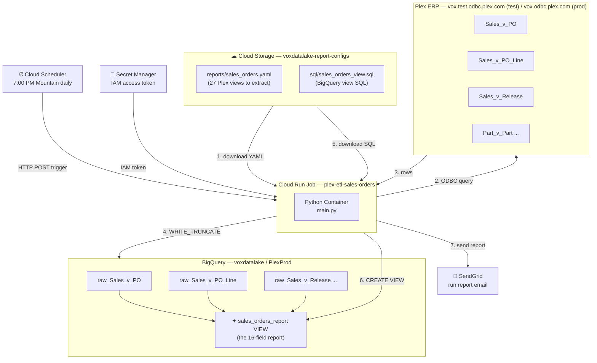
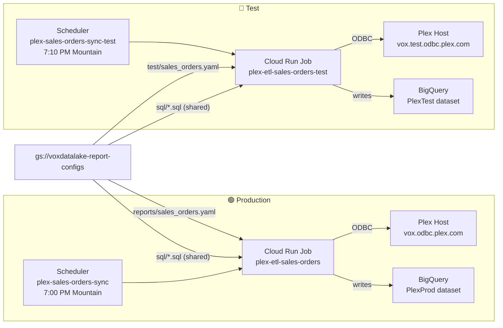
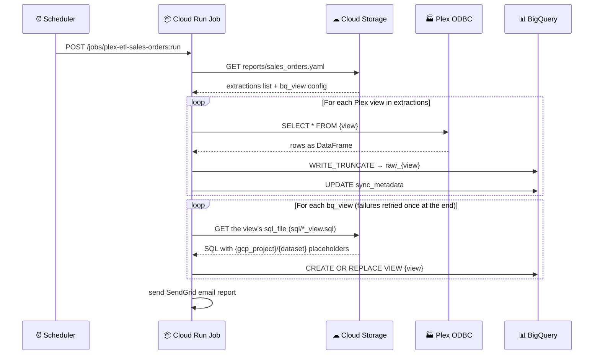

# Plex → BigQuery Pipeline — Cheatsheet

*Last reviewed 2026-09-25.*

The one-page **command** reference. Short on rationale on purpose:
[CONTRIBUTING.md](../CONTRIBUTING.md) owns the workflow and why each lock
exists, [OPERATIONS.md](OPERATIONS.md) owns day-2 procedures,
[CLAUDE.md](../CLAUDE.md) owns the traps. Paths below are relative to the repo
root unless they start with `C:/`.

---

## Mental Model (30 seconds)

This pipeline **copies Plex ERP data into BigQuery** so the data team can query it with SQL instead of clicking around in Plex.

- **Plex** stores the business data (orders, parts, customers) in tables called *views*
- **ODBC** is the wire — a standard database connector, same idea as JDBC in Java
- **Cloud Run** is the script runner — GCP's serverless container executor
- **BigQuery** is the data warehouse — think Google Sheets but for millions of rows and real SQL
- **Cloud Storage (GCS)** holds the report YAML/SQL the jobs read at run time. Terraform writes those objects from `reports/` on `main` (via `./scripts/deploy.sh`), so a YAML/SQL change needs **no image rebuild — but it does need a deploy**

**13 pipelines** (`reports/*.yaml`) → **26 Cloud Run jobs** (prod + test each) →
**52 schedulers** (each job has a `-retry` twin) → **68 BigQuery views**. The
nightly cascade runs **7:00 PM → 10:50 PM Mountain** (`America/Denver`), 10
minutes apart; Label Design runs twice a day at **9:30 AM and 1:30 PM**
(test +10 min). Full schedule and run history:
[EMAIL_SCHEDULE.md](EMAIL_SCHEDULE.md). Any job can also be run by hand.

---

## Daily workflow — commands

Why each piece exists: CONTRIBUTING.md → *Branches, folders and locks*.

### Folders, branches, workspaces

| Project | Branch | Folder (git worktree) | Open with |
|---|---|---|---|
| **Deploy** — merge + deploy only, no edits | `main` | `C:\F\Parasol\plex-to-big-query` (primary) | `main-deploy.code-workspace` |
| Vox Scorecard | `dev-scorecard` | `C:\F\Parasol\ptbq-scorecard` | `scorecard.code-workspace` |
| Scorecard Sandbox | `dev-sandbox` | `C:\F\Parasol\ptbq-sandbox` | `sandbox-scorecard.code-workspace` |
| Label Design | `dev-label-design` | `C:\F\Parasol\ptbq-label-design` | `label-design.code-workspace` |
| Shared tooling (`main.py`, hooks, terraform structure) | `dev` | `C:\F\Parasol\ptbq-dev` | `dev-shared.code-workspace` |

Which files belong to which project is defined once, in `.githooks/hooks.py`
(`LABEL_DESIGN`, `SCORECARD`); everything else is shared and may be committed
from any branch.

### One-time setup (new machine / fresh clone)

```bash
git clone https://github.com/Parasol-Group-Inc/plex-to-big-query.git C:/F/Parasol/plex-to-big-query
cd C:/F/Parasol/plex-to-big-query
./scripts/install_hooks.sh                         # once per clone — sets core.hooksPath=.githooks for every worktree
git worktree add ../ptbq-scorecard dev-scorecard
git worktree add ../ptbq-sandbox dev-sandbox
git worktree add ../ptbq-label-design dev-label-design
git worktree add ../ptbq-dev dev
```

- Copy nothing into the worktrees except `.env` (only if you run Docker there).
- `terraform/terraform.tfvars` lives **only in the primary folder** — that is where deploys happen.
- Local run / ODBC setup: [LOCAL_SETUP.md](LOCAL_SETUP.md). GCP from zero: [DEPLOYMENT_GUIDE.md](DEPLOYMENT_GUIDE.md).

### The locks and their overrides

Set the override **for that one command only**, e.g. `ALLOW_MAIN_COMMIT=1 git commit -m "..."`.
The hook prints it, so the reason stays visible. **Never `--no-verify`** — it
skips every hook without a trace.

| Lock | Hook | Blocks | Override |
|---|---|---|---|
| Folder ↔ branch | pre-commit | committing in a project folder that has another branch checked out | `ALLOW_WRONG_FOLDER=1` |
| `main` takes merges only | pre-commit | a non-merge commit on `main` | `ALLOW_MAIN_COMMIT=1` |
| Own project only | pre-commit | Label Design files on a scorecard branch (or reverse); one commit mixing projects | `ALLOW_CROSS_PROJECT=1` |
| Changelog with deployables | pre-commit | `reports/` or `terraform/` changes (non-`.md`) without `CHANGELOG.md` staged | `ALLOW_NO_CHANGELOG=1` |
| Prod/test YAML pair | pre-commit | the staged prod and test YAML of a pipeline with different `plex_view:` counts | `ALLOW_YAML_MISMATCH=1` |
| Only `main` goes to `main` | pre-push | `git push origin dev-x:main`; non-fast-forward pushes to `main` | `ALLOW_MAIN_PUSH=1` |
| Deploy guard | inside Terraform (`scripts/tf_guard.py`) | any `plan`/`apply` not in the primary folder, on `main`, clean, and equal to `origin/main` | `TF_GUARD_OVERRIDE="why"` — **read-only plans only** |
| Reviewed deploy | `scripts/deploy.sh` | applying anything but the plan you just reviewed | none — you type the change count |

### Start of work

```bash
cd C:/F/Parasol/ptbq-<project>        # or open its .code-workspace
git branch --show-current             # must match the folder (table above)
git status --short                    # anything uncommitted that isn't yours?
git worktree list                     # every folder and the branch it holds
git pull
```

Claude Code sessions also get a user-level hook,
`~/.claude/hooks/session_branch_guard.py` (not in this repo). On every prompt
it warns if another live session is in the same folder or on the same branch,
or if this session's branch changed under it. It never blocks — heed it.

### Commit, push, into `main`

```bash
# On the project's dev branch, in its folder. CHANGELOG.md in the same commit
# for anything under reports/ or terraform/; docs/reports/*.md for any report change.
git add <files> CHANGELOG.md
git commit -m "feat(scorecard): ..."
git push origin dev-scorecard

# Into main — by PR (reviewable)...
gh pr create --base main --head dev-scorecard --title "..." --body "..."
gh pr merge <number> --merge          # a merge commit; main takes merges only
# ...or by a local merge in the primary folder:
cd C:/F/Parasol/plex-to-big-query && git pull && git merge --no-ff dev-scorecard && git push origin main
```

If `git push` fails with `403 Permission ... denied` while `gh auth status`
looks fine, it's the GitHub-side repo access issue in CLAUDE.md → *Known
friction* — needs an org admin, not local debugging.

### Deploy config / SQL / infrastructure — `./scripts/deploy.sh`

```bash
cd C:/F/Parasol/plex-to-big-query && git pull && ./scripts/deploy.sh
```

Run it yourself in a terminal (it prompts). Never a bare `terraform apply`. What it does:

1. **Preflight** (`scripts/deploy_preflight.sh`) — on `main`, clean tree.
2. **Up to date** — fetches; refuses unless `HEAD == origin/main`.
3. **Plan to a file** — `terraform plan -out=deploy.tfplan`; the deploy guard runs inside it.
4. **Review** (`scripts/plan_review.py`) — downloads each changed GCS object and splits **real content changes** from **line-ending-only** re-uploads, tags each with its project, flags destroys/replaces.
5. **Confirm** — type the total resource-change count it prints.
6. **Apply that exact plan** — nothing re-planned.
7. **Tag** — `deploy/<UTC timestamp>` on the deployed commit, pushed to GitHub.

Read-only drift check (nothing applied):

```bash
# Primary folder, on a clean main == origin/main: no override needed
cd C:/F/Parasol/plex-to-big-query/terraform && terraform plan -var-file=terraform.tfvars
# What a dev branch WOULD change vs live (worktree; run `terraform init` there once):
cd C:/F/Parasol/ptbq-<project>/terraform && terraform init
TF_GUARD_OVERRIDE="drift check from dev-x" terraform plan -var-file=C:/F/Parasol/plex-to-big-query/terraform/terraform.tfvars
```

Never `apply` with `TF_GUARD_OVERRIDE`.

### Deploy the image (Python changes: `main.py`, `email_utils.py`, `Dockerfile`)

```bash
cd C:/F/Parasol/plex-to-big-query && git pull
./scripts/deploy_preflight.sh          # Cloud Build has no guard of its own — run this every time
gcloud builds submit --config deploy/cloudbuild.yaml --project=voxdatalake \
  --substitutions=SHORT_SHA=$(git rev-parse --short HEAD) .
```

`SHORT_SHA` is **not** automatic on a local submit — only on a git-triggered
build. The build pushes `etl:<sha>` + `etl:latest`, updates every job in
`_ALL_JOBS` (all 26 — keep it in sync with `terraform/main.tf`), and
smoke-tests `plex-etl-sales-orders-test` only; prod is never executed
automatically. Terraform never moves images (`lifecycle.ignore_changes` on
`image`). Manual build/push/update loop:
[TROUBLESHOOTING.md → Full rebuild procedure](TROUBLESHOOTING.md#full-rebuild-procedure).

### After any deploy

```bash
# 1. Run the test job(s) you changed
gcloud run jobs execute plex-etl-<pipeline>-test --region=us-central1 --project=voxdatalake --wait

# 2. Verify the VIEW, not the exit code — exit 0 / PARTIAL can still mean the view failed to create
bq query --use_legacy_sql=false --project_id=voxdatalake \
  "SELECT COUNT(*) FROM \`voxdatalake.PlexTest.<view_name>\`"
#    and check the log line "Report '<name>_test' loaded: N extraction(s)" against
grep -c 'plex_view:' reports/<pipeline>.yaml reports/test/<pipeline>.yaml

# 3. Re-sync every dev branch with what is live (after the primary folder has pulled)
for d in ptbq-scorecard ptbq-sandbox ptbq-label-design ptbq-dev; do
  git -C C:/F/Parasol/$d merge main && git -C C:/F/Parasol/$d push
done
```

Why step 2 matters: CLAUDE.md → *Verifying a report deploy actually worked*.
Step 3: the `dev*` branches never merge into each other, so they drift on
shared files until they take `main` back. Don't merge under a session that's
mid-edit in that folder.

### Iterating before it's merged — test paths only

**Never `gcloud storage cp` into the prod paths** (`gs://voxdatalake-report-configs/reports/…`).
That is how a prod rollback happened: prod diverged from `main`, and the next
`deploy.sh` silently put `main`'s copy back. Terraform owns every object in the
bucket; whatever isn't on `main` gets reverted.

```bash
# YAML — test copy only, then run only the test job
gcloud storage cp reports/test/<pipeline>.yaml gs://voxdatalake-report-configs/test/ --project=voxdatalake
gcloud run jobs execute plex-etl-<pipeline>-test --region=us-central1 --project=voxdatalake --wait
```

**SQL has no test path.** There is one object per view,
`gs://voxdatalake-report-configs/sql/<name>_view.sql`, read by **both** the
prod and the test job. Copying one there changes prod at its next scheduled
run. So iterate on SQL without touching the bucket:

```bash
# Compile check (dry run) — substitute the placeholders the job fills in
sed -e 's/{gcp_project}/voxdatalake/g' -e 's/{dataset}/PlexTest/g' \
  reports/sql/<name>_view.sql > "$TEMP/v.sql"
bq query --use_legacy_sql=false --project_id=voxdatalake --dry_run < "$TEMP/v.sql"
# (bq on Windows: see "Check BigQuery results" under Quick Commands)
```

- **Scorecard views:** put the draft in `scripts/scorecard_sandbox/proposed_sql/` (same file name) and `python scripts/scorecard_sandbox/build.py --views` — sandbox only, printed as `⚠ … using PROPOSED SQL (not deployed)`.
- **If you really must** copy a SQL file into `sql/`: run only the `-test` job, know prod picks up the same object tonight, and land it through `main` + `deploy.sh` the same day.
- Either way the change is real only once it's on `main` and deployed.

### Scorecard sandbox (`voxdatalake.ScorecardSandbox`)

```bash
python scripts/scorecard_sandbox/build.py            # full rebuild, ~7.5 min
python scripts/scorecard_sandbox/build.py --views    # recreate views only
python scripts/scorecard_sandbox/build.py --verify   # rows + month span per view
python scripts/scorecard_sandbox/snapshot_check.py "2026-09-23 12:00:00+00" now   # score a snapshot instant
```

Needs `gcloud auth application-default login`. Plex tables are copied from
PlexTest by **time travel** at `build.SNAPSHOT` (a 7-day window): after
2026-09-30 the current instant expires — pick a new one that scores clean with
`snapshot_check.py` and update `SNAPSHOT`. Rules and design:
[scripts/scorecard_sandbox/README.md](../scripts/scorecard_sandbox/README.md).

### What was live when

```bash
git tag -l 'deploy/*'                         # every deploy.sh apply, UTC-stamped
git show --stat deploy/2026-09-25T1830Z       # what that deploy contained (example tag name)
git log --oneline deploy/<older>..deploy/<newer>
```

---

## System Architecture



*Shown: the Sales Orders pipeline as a worked example — the same shape repeats
for all 13 pipelines (26 jobs).*

---

## Environments: Prod vs Test



- **YAML is per-environment** (`reports/` vs `test/` in GCS, from `reports/*.yaml` vs `reports/test/*.yaml` in git — two hand-kept files, change both). **SQL is shared** (`sql/`).
- **Failure retry:** each of the 26 jobs has a `-retry` scheduler at **9:45 PM Mountain** that re-runs the job only if today's scheduled run genuinely FAILED (not PARTIAL), checked against `job_run_log`. See [OPERATIONS.md → Failure Retry](OPERATIONS.md#failure-retry-945-pm-mountain).
- **Naming:** jobs `plex-etl-<pipeline>[-test]`; schedulers `plex-<pipeline>-sync[-test][-retry]`. Names are immutable — a rename is a destroy/recreate (CLAUDE.md → *Job naming*).

## Active Reports

| Pipeline (`reports/*.yaml`) | Cloud Run job (prod; test adds `-test`) | Schedule prod / test (Mountain) | Plex views | BQ views | Headline views |
|---|---|---|---|---|---|
| `sales_orders` | `plex-etl-sales-orders` | 7:00 / 7:10 PM | 27 | 27 | `sales_orders_report`, `sales_orders_open_report`, `shipping_revenue_report`, `sales_mtd_summary_report`, `revenue_vs_goal_report`, `sales_vs_goal_report` |
| `work_orders` | `plex-etl-work-orders` | 7:20 / 7:30 PM | 15 | 19 | `work_orders_report`, `mfg_job_schedule_report`, `labeling_open_work_orders_report`, `*_daily_report`, `production_vs_goal_report` |
| `purchasing_open_orders` | `plex-etl-purchasing-open-orders` | 7:40 / 7:50 PM | 6 | 2 | `purchasing_open_orders_report`, `purchasing_po_pending_approval_report` |
| `part_obsolescence` | `plex-etl-part-obsolescence` | 8:00 / 8:10 PM | 1 | 1 | `part_obsolescence_report` |
| `inventory_activity` | `plex-etl-inventory-activity` | 8:20 / 8:30 PM | 2 | 2 | `inventory_activity_report`, `inventory_avg_daily_usage_report` |
| `inventory_snapshot` | `plex-etl-inventory-snapshot` | 8:40 / 8:50 PM | 3 | 3 | `inventory_snapshot_report`, `inventory_valuation_summary_report`, `inventory_valuation_total_report` |
| `quality_nonconformance` | `plex-etl-quality-nonconformance` | 9:00 / 9:10 PM | 13 | 5 | `quality_nonconformance_report`, `quality_turnaround_time_report`, `quality_deviation_report`, `quality_disposition_cost_report` |
| `part_on_hand_inventory` | `plex-etl-part-on-hand-inventory` | 9:20 / 9:30 PM | 4 | 5 | `part_on_hand_inventory_report`, `inventory_risk_analysis_report`, `part_cycle_count_report` |
| `purchasing_pending_requisitions` | `plex-etl-purchasing-pending-requisitions` | 9:40 / 9:50 PM | 4 | 1 | `purchasing_pending_requisitions_report` |
| `sales_quotes` | `plex-etl-sales-quotes` | 10:00 / 10:10 PM | 2 | 1 | `sales_quotes_open_report` |
| `sales_returns` | `plex-etl-sales-returns` | 10:20 / 10:30 PM | 2 | 1 | `sales_returns_open_report` |
| `quality_supplier_returns` | `plex-etl-quality-supplier-returns` | 10:40 / 10:50 PM | 3 | 1 | `quality_supplier_returns_pending_report` |
| `label_design` | `plex-etl-label-design` | 9:30 AM + 1:30 PM / 9:40 AM + 1:40 PM | 12 | 1 | `label_design_report` (feeds the Monday.com queue — [label-design/STATUS.md](../label-design/STATUS.md)) |

Counts are `grep -c -E '^\s*-\s*plex_view:'` and the `bq_view` entries per
YAML; `scorecard_goals_resolved` is listed in both `sales_orders` and
`work_orders`, hence 68 unique views. Every view has a business doc:
[docs/reports/REPORT_CATALOG.md](reports/REPORT_CATALOG.md).

> **Email subject** is `[Plex ETL] - {Category}: {Pipeline} — {date}` (e.g. `[Plex ETL] - Sales: Orders — 2026-09-04`), built from each config's `category` plus its pipeline name. A leading category word is stripped so `quality_nonconformance` reads `Quality: Nonconformance`. Prod and test share a subject on purpose (environment is a badge in the body); each view's `display_name` is in the body's report list. A subject change is a code change → image deploy. See [EMAIL_SCHEDULE.md](EMAIL_SCHEDULE.md).
>
> ⚠ **Goals are not a pipeline.** People type them into the manual-data app (`deploy/manual_data_app/`, Apps Script → Google Sheet → `scorecard_goals_app`). The legacy `scorecard_goals` table stays as a fallback (it still holds the 68 real sales rep-month goals). The view `scorecard_goals_resolved` picks one goal per metric/month/scope, app first. `revenue_vs_goal_report`, `sales_vs_goal_report` and `production_vs_goal_report` read only that view. Neither table is created by Terraform or the ETL, and the resolver fails to create if either is missing. See CLAUDE.md → *Goals* and [docs/reports/scorecard_goals_resolved.md](reports/scorecard_goals_resolved.md).
>
> `raw_Part_v_Part` is **shared** across several reports — owned by the Sales Orders pipeline (runs first); others reference it in their JOIN view without re-extracting it.
>
> History of how the reports were built: [NETSUITE_REPORT_BUILD_PLAN.md](NETSUITE_REPORT_BUILD_PLAN.md), [MFG_JOB_SCHEDULE_BUILD_PLAN.md](MFG_JOB_SCHEDULE_BUILD_PLAN.md), `reports-list/`, `spreadsheets/`.

---

## How the Multi-Report Config Works



**The key point:** the YAML and SQL live in GCS, not in the container, so
changing them needs no image rebuild. Terraform writes those GCS objects from
the files on `main`, so the way a change reaches them is **merge →
`./scripts/deploy.sh`**. A view is only recreated during a pipeline run.

---

## File Map

The authoritative layout table (with project ownership) is in
[README.md → Repository layout](../README.md#repository-layout).

```
plex-to-big-query/
  main.py, email_utils.py, templates/  # ETL engine + run email (image deploy)
  Dockerfile, entrypoint.sh, requirements.txt, docker-compose.yml, .env.example
  extract_schema_catalog.py            # live column catalog via ODBC (catalog/)
  reports/                   # REPORT DEFINITIONS (Terraform → GCS; deploy.sh)
    <pipeline>.yaml        # 13 prod configs → PlexProd
    test/<pipeline>.yaml   # 13 hand-kept test copies → PlexTest (change both)
    sql/*_view.sql         # 68 files, one per bq_view (its sql_file), shared by prod + test
  terraform/                 # all GCP infra; main.tf also runs the deploy guard
    main.tf, variables.tf, outputs.tf, terraform.tfvars.example
    terraform.tfvars       # gitignored, primary folder only
  scripts/
    deploy.sh              # THE deploy (config/SQL/infra)
    deploy_preflight.sh    # on main + clean; run before any gcloud builds submit
    tf_guard.py            # deploy guard, run by Terraform itself
    plan_review.py         # content-vs-line-ending plan review
    install_hooks.sh       # once per clone
    scorecard_sandbox/     # ScorecardSandbox build (build.py, snapshot_check.py, proposed_sql/)
    board/                 # Migration Board generator (board_data.py TILES = tile → view map)
    scorecard_status.ps1   # does every scorecard tile have data behind it?
    distill_glossary.py    # builds docs/PLEX_GLOSSARY.md
    backup_to_bucket.ps1   # backs repo + local-only files up to GCS
    build_logo_gs.py       # email logo assets
    pull_monday_board_snapshot.py, replicate_board_columns.py  # Monday.com helpers
  .githooks/                 # hooks.py (every lock + project file map), pre-commit, pre-push
  *.code-workspace           # 5 VS Code workspaces, one per folder (table above)
  deploy/
    cloudbuild.yaml        # image build + update all 26 jobs (_ALL_JOBS)
    setup.sh               # DEPRECATED bootstrap script, kept for reference (use terraform/)
    manual_data_app/       # [Scorecard] goals + safety-incident web app (Apps Script)
    label_design_sync/     # [Label Design] BigQuery → Sheet → Monday sync (Apps Script)
    label_design_trigger/  # [Label Design] run-the-sync-on-demand web app (on dev-label-design)
  label-design/              # [Label Design] STATUS.md (read first), Monday board docs
  label_design_service/      # [Label Design] push service (reason-code parser + tests)
  docs/                      # guides: this file, OPERATIONS, TROUBLESHOOTING, EMAIL_SCHEDULE,
                             QUICKSTART, DEPLOYMENT_GUIDE, LOCAL_SETUP, TECHNICAL_REFERENCE,
                             FRONTEND_GUIDE, API_REFERENCE, DISASTER_RECOVERY, TEARDOWN, …
    reports/               # one business doc per deployed view + REPORT_CATALOG.md
    SCORECARD_DATA_LOAD.md, SCORECARD_SANDBOX_FINDINGS.md   # [Scorecard]
    *_BUILD_PLAN.md                                         # build history
    archive/               # finished history (old code review, NetSuite parity items, driver-licence note, …)
    PLEX_GLOSSARY.md (generated), PLEX_REPORTS_CATALOG.md
  config/                    # odbc.ini (DSNs), odbcinst.ini (DataDirect driver)
  driver/                    # Plex Linux ODBC driver (gitignored — copy manually)
  catalog/                   # Plex ODBC view catalogs; start at plex_catalog_index.md
  mapping/                   # Plex UI report + data-source catalogs; NetSuite → Plex mapping
  spreadsheets/              # Google Sheets being mapped; hub SPREADSHEET_CATALOG.md
  reports-list/              # company report inventory per dept; hub REPORTS_LIST_CATALOG.md
  score-card-reference/, meetings-reference/, forms/, assets/   # source material
  CHANGELOG.md, CLAUDE.md, CONTRIBUTING.md, README.md
```

---

## Environment Variables

Full table (defaults, what needs a rebuild vs an apply, legacy single-view
vars, retry vars): [TECHNICAL_REFERENCE.md → Environment variable reference](TECHNICAL_REFERENCE.md#environment-variable-reference).
Set on the jobs by Terraform; locally from `.env`. The ones you'll actually touch:

| Variable | What it does |
|---|---|
| `REPORT_CONFIG_GCS_PATH` | GCS URI of the job's YAML — **the key variable**; empty = legacy single-view mode (`PLEX_VIEW`, `PLEX_FILTER`, `PLEX_DATE_COL`) |
| `BQ_DATASET` | `PlexProd` / `PlexTest` — also drives the PRODUCTION/TEST email badge |
| `OUTPUT_MODE` | `local` writes CSVs to `./output/` (docker-compose); `bigquery` (default) writes to BQ |
| `PLEX_HOST` / `PLEX_PORT` / `PLEX_SERVER_DATASOURCE` | `vox[.test].odbc.plex.com` / `19995` / `ReportDataSource` |
| `PLEX_ACCESS_TOKEN` | `.env` only — direct IAM token for local runs; jobs read it from Secret Manager |
| `SENDGRID_ENABLED`, `REPORT_FROM_EMAIL`, `REPORT_TO_EMAILS` | Run email on/off, sender, recipients |

Secret Manager secret **names** (not values): `plex-access-token`,
`sendgrid-api-key`, and the fallback-auth trio `plex-odbc-user`,
`plex-odbc-password`, `plex-company-code`.

---

## Quick Commands

### Run a job and read its logs

```bash
# Any pipeline: plex-etl-<pipeline>[-test]. Test first; prod only after the test run checks out.
gcloud run jobs execute plex-etl-work-orders-test --region=us-central1 --project=voxdatalake --wait
gcloud run jobs execute plex-etl-work-orders      --region=us-central1 --project=voxdatalake --wait

# Logs of the last day's runs
gcloud logging read \
  'resource.type="cloud_run_job" AND resource.labels.job_name="plex-etl-sales-orders-test"' \
  --project=voxdatalake --limit=100 --freshness=1d --format='value(textPayload)'

# What exists
gcloud run jobs list --region=us-central1 --project=voxdatalake
gcloud scheduler jobs list --location=us-central1 --project=voxdatalake
gcloud storage ls gs://voxdatalake-report-configs/test/
```

If `gcloud` fails with *"Reauthentication failed. cannot prompt during
non-interactive execution"*, a human has to run `gcloud auth login` (CLAUDE.md
→ *Known friction*).

### Local health check (read-only)

```bash
docker compose build && docker compose up   # .env OUTPUT_MODE=local: Part_v_Part from the test host → ./output/
docker compose down
```

### Check BigQuery results

> **Windows:** `bq` from Git Bash can fail with `python3.12: command not found`.
> Use `bq.cmd`, or run from PowerShell/cmd with the SQL in a file:
> `cmd /c "bq query --use_legacy_sql=false --project_id=voxdatalake < query.sql"`.
> Feed SQL from a file, not an argument (a leading `--` comment gets parsed as a
> flag) and not piped from PowerShell (it prepends a BOM BigQuery rejects).
> Or use the [BigQuery Console](https://console.cloud.google.com/bigquery).

```bash
# Row count of a raw table
bq.cmd query --project_id=voxdatalake --nouse_legacy_sql \
  "SELECT COUNT(*) AS n FROM \`voxdatalake.PlexTest.raw_Sales_v_PO\`"

# Preview a view
bq.cmd query --project_id=voxdatalake --nouse_legacy_sql \
  "SELECT * FROM \`voxdatalake.PlexTest.sales_orders_report\` LIMIT 10"

# Last sync metadata
bq.cmd query --project_id=voxdatalake --nouse_legacy_sql \
  "SELECT table_name, synced_at, rows_written FROM \`voxdatalake.PlexTest.sync_metadata\` ORDER BY synced_at DESC LIMIT 20"

# Run status per job (what the retry scheduler reads)
bq.cmd query --project_id=voxdatalake --nouse_legacy_sql \
  "SELECT job_name, run_date, status, run_mode, logged_at FROM \`voxdatalake.PlexTest.job_run_log\` ORDER BY logged_at DESC LIMIT 20"
```

### Secrets management

```bash
# Store or replace the Plex IAM token (it does not expire — only replace it
# if you generated a new one in Plex)
echo -n 'your-token-here' | \
  gcloud secrets versions add plex-access-token --data-file=- --project=voxdatalake

# Read back a secret to verify it's stored
gcloud secrets versions access latest --secret=plex-access-token --project=voxdatalake
```

---

## How to Add a New Report

> **Full guide** (Plex view discovery, YAML schema, SAFE_CAST patterns, full
> Terraform blocks): [OPERATIONS.md → Add a Brand-New Report](OPERATIONS.md#add-a-brand-new-report).
> Work on the owning project's dev branch; everything lands through `main` + `./scripts/deploy.sh`.

1. **YAML, prod + test** — copy an existing pair; change `report_name` (`_test` suffix in the test copy), `extractions`, `bq_view`. Set `category` (department) and every `display_name`, or the email subject falls back to a generic line.
   ```bash
   cp reports/work_orders.yaml reports/purchasing_orders.yaml
   cp reports/test/work_orders.yaml reports/test/purchasing_orders.yaml
   ```
2. **SQL** — `reports/sql/<name>_view.sql`, one per `bq_view` (referenced by its `sql_file`). Always `{gcp_project}` / `{dataset}` placeholders; `SAFE_CAST` numeric join keys on **both** sides. Compile-check with the dry run above.
3. **Terraform** (`terraform/main.tf`) — copy the `work_orders` set:
   - `google_storage_bucket_object`s: `*_config_prod`, `*_config_test`, and one per new SQL file (this is what puts them in GCS);
   - two `google_cloud_run_v2_job`s (prod + `-test`);
   - four `google_cloud_scheduler_job`s (prod, test, and a `-retry` each).

   Every job needs this block — without it the next unrelated apply reverts the
   job to `var.image_url`:
   ```hcl
   lifecycle {
     ignore_changes = [
       template[0].template[0].containers[0].image,
       client,
       client_version,
     ]
   }
   ```
4. **Cloud Build** — add both job names to `_ALL_JOBS` in `deploy/cloudbuild.yaml`, or they never get a new image.
5. **Docs** — `CHANGELOG.md`, a `docs/reports/<view>.md` per view (+ `REPORT_CATALOG.md` row), the status line in `reports-list/`/`spreadsheets/`.
6. **Land and deploy** — commit on the dev branch → `main` → `./scripts/deploy.sh` (new jobs come up on `image_url` from `terraform.tfvars` — check it matches a live job first) → run the `-test` job → verify the view.

Later YAML/SQL changes: same path, no image rebuild.

---

## Plex View Naming Convention

**Rule:** `{Database}_v_{ViewName}` — the SQL Dev tree shows only `ViewName`; always add the database prefix when querying. Every table in a Plex SQL Developer query must be aliased, even single-table SELECTs.

| What you see in SQL Dev | What you query via ODBC | Database |
|---|---|---|
| `PO` | `Sales_v_PO` | Sales |
| `PO_Line` | `Sales_v_PO_Line` | Sales |
| `Order_Salesperson` | `Sales_v_Order_Salesperson` | Sales |
| `Release` | `Sales_v_Release` | Sales |
| `PO_Status` | `Sales_v_PO_Status` | Sales |
| `Customer` | `Common_v_Customer` | Common |
| `Part` | `Part_v_Part` | Part |
| `Customer_Part_Price` | `Part_v_Customer_Part_Price` | Part |
| `Part_Product_Type` | `Part_v_Part_Product_Type` | Part |
| `Plexus_User` | `Plexus_Control_v_Plexus_User` | Plexus_Control |
| `PO` (purchasing) | `Purchasing_v_PO` | Purchasing |
| `Employee` | `Personnel_v_Employee` | Personnel |

To discover view names: open **Plex SQL Dev** → expand the database tree → right-click any view → `{Database}_v_{NodeName}`.

---

## GCP Services — What Each One Does Here

| GCP Service | What it is (in general) | What it does in this pipeline |
|---|---|---|
| **Cloud Run Jobs** | Serverless container executor — run a Docker container on demand, pay per second | Runs `main.py` — queries Plex, loads BigQuery (26 jobs, one shared image) |
| **Cloud Scheduler** | Managed cron — fires HTTP requests on a schedule | Triggers each job (the nightly cascade, Label Design twice a day, and a 9:45 PM `-retry` per job — see Active Reports) |
| **BigQuery** | Serverless data warehouse — query terabytes with SQL, pay per query | Stores the raw Plex tables + the views the data team queries (`PlexProd`, `PlexTest`, `ScorecardSandbox`) |
| **Cloud Storage (GCS)** | Object storage — like S3, stores files | `voxdatalake-report-configs`: YAML configs and view SQL (written by Terraform); `voxdatalake-terraform-state`: Terraform state |
| **Secret Manager** | Encrypted secret store | Stores the Plex IAM token and SendGrid API key |
| **Artifact Registry** | Docker image registry — like Docker Hub but in GCP | `us-central1-docker.pkg.dev/voxdatalake/plex-pipeline/etl:<sha>` |
| **Cloud Build** | Managed build runner | `deploy/cloudbuild.yaml`: build, push, update all jobs, smoke-test |
| **IAM / Service Accounts** | Identity and access management | Jobs run as `plex-etl-sa@voxdatalake.iam.gserviceaccount.com`, with only the permissions it needs |

**Service-account roles** (`google_project_iam_member.etl_roles` in `terraform/main.tf`):
`bigquery.dataEditor` (write tables), `bigquery.jobUser` (run load jobs),
`secretmanager.secretAccessor` (read the token), `artifactregistry.reader`
(pull the image), `run.invoker` (scheduler → job); plus bucket-level
`storage.objectViewer` on `voxdatalake-report-configs` (read YAML/SQL).

### GCP Console quick links

| What | URL |
|---|---|
| Cloud Run Jobs | `console.cloud.google.com/run/jobs?project=voxdatalake` |
| BigQuery | `console.cloud.google.com/bigquery?project=voxdatalake` |
| Cloud Storage | `console.cloud.google.com/storage?project=voxdatalake` (look, don't edit — see *Iterating*) |
| Secret Manager | `console.cloud.google.com/security/secret-manager?project=voxdatalake` |
| Cloud Scheduler | `console.cloud.google.com/cloudscheduler?project=voxdatalake` |
| Job logs | `console.cloud.google.com/logs?project=voxdatalake` |

---

## Troubleshooting Quick Fixes

More in [TROUBLESHOOTING.md](TROUBLESHOOTING.md).

### ODBC: `[08001] [DataDirect]` or connection refused

```bash
# Confirm the host and port:
#   Test:  PLEX_HOST=vox.test.odbc.plex.com  PORT=19995
#   Prod:  PLEX_HOST=vox.odbc.plex.com       PORT=19995
# ServerDataSource must be exactly: ReportDataSource
```

### ODBC: `HY000 10300` — access token invalid

```bash
# The IAM token in Secret Manager is wrong or was overwritten.
# The Plex IAM token does NOT expire — it only breaks if replaced with the wrong value.
gcloud secrets versions access latest --secret=plex-access-token --project=voxdatalake
echo -n 'PLEX_TOKEN_HERE' | gcloud secrets versions add plex-access-token \
  --data-file=- --project=voxdatalake
```

### ODBC: `HY000 3059` — DSN not found

```bash
# The code used DSN-based auth instead of driver-direct.
# Fix: ensure PLEX_ACCESS_TOKEN (or SECRET_ACCESS_TOKEN) is set.
# The IAM token path uses driver-direct; only username/password auth uses the DSN.
```

### `View not found: {ViewName}`

```bash
# Missing the {Database}_v_ prefix.   Wrong: PO   Right: Sales_v_PO
# Check the plex_view field on the relevant entry in that report's
# extractions[] list (reports/*.yaml — each file has many entries).
```

### `403` / permission denied — BigQuery, GCS config, or Secret Manager

The service account is missing a role (list under *GCP Services*). Terraform
grants them; to restore one by hand:

```bash
SA="serviceAccount:plex-etl-sa@voxdatalake.iam.gserviceaccount.com"
gcloud projects add-iam-policy-binding voxdatalake --member="$SA" --role="roles/bigquery.dataEditor"            # BigQuery 403
gcloud projects add-iam-policy-binding voxdatalake --member="$SA" --role="roles/secretmanager.secretAccessor"   # Secret Manager
gcloud storage buckets add-iam-policy-binding gs://voxdatalake-report-configs --member="$SA" --role="roles/storage.objectViewer"  # GCS config 403
```

### Job exits 0 / PARTIAL but the view is missing or stale

Query the view (see *After any deploy*). Usual causes: a join without
`SAFE_CAST` on both sides, a view reading a missing sibling view or goals
table, or the test YAML lagging the prod one (the log's `loaded: N
extraction(s)` line shows it). CLAUDE.md → *Verifying a report deploy actually
worked*.

### Job exits with 0 rows extracted

```bash
# Is the Plex view empty, or the filter too restrictive?
# A 0-row response does NOT clear the BigQuery table — existing data is kept
# and a warning is logged (safety guard, 2026-07-14).
# Quick one-off check of ONE view, in local mode against the test host. This
# uses the legacy single-view env vars — it does NOT exercise the multi-report
# YAML path. To reproduce a real failure, point REPORT_CONFIG_GCS_PATH at a
# copy of that job's YAML instead.
docker run --env-file .env \
  -e OUTPUT_MODE=local \
  -e PLEX_VIEW=Sales_v_PO \
  -e PLEX_FILTER="" \
  -v "$(pwd)/output:/output" \
  us-central1-docker.pkg.dev/voxdatalake/plex-pipeline/etl:latest
```

### Report view shows dates as huge numbers (e.g. `1750118400000000000`)

Plex dates land as INT64 *nanoseconds*; use the date-conversion pattern under
*Reference* below (`DIV` not `/`, and every branch through `CAST(col AS
STRING)`). After fixing the SQL, it reaches the view only via `main` →
`deploy.sh` → a pipeline run (the view is recreated only during a run). A
view-SQL compile error shows up as a PARTIAL email with the BigQuery error and
a `[line:column]` into the substituted SQL.

### Terraform plan shows changes you didn't intend

- **Line-ending-only re-uploads** (CRLF vs LF) are harmless; `plan_review.py` lists them separately so a real change can't hide among them.
- **A real content change you didn't make** means the live GCS object differs from `main` — someone copied a file straight into the bucket or edited it in the Console. Applying reverts it to `main`. Find out whose change it was and land it on `main` first if it should stay.
- **`google_storage_bucket_object.*_config_prod` changing** can also mean prod was simply behind `main`; `deploy.sh` syncs it.
- **Destroy/replace** (e.g. a job rename) — read every one; a recreated job comes up on `image_url`.
- **`DEPLOY GUARD: refusing`** — you're not in the primary folder on a clean, pushed `main`. For a look only: `TF_GUARD_OVERRIDE="why" terraform plan -var-file=terraform.tfvars`.

---

## Sales Orders Report — 16-Field Mapping

`sales_orders_report` (`reports/sql/sales_orders_view.sql`) — 16 output columns. The pipeline now extracts 27 Plex views for all its reports; these are the ones this view reads:

| Field | Source | View | Join key |
|---|---|---|---|
| `document_so` | `PO_No` | `Sales_v_PO` | — (header) |
| `date_created` | `PO_Date` | `Sales_v_PO` | — |
| `date_approved` | `MIN(Change_Date)` WHERE `PO_Status_Key=2073` | `Sales_v_PO_Change` | `PO_Key` |
| `order_type` | `PO_Type` | `Sales_v_PO_Type` | `PO_Type_Key` |
| `from_quote` | `From_PO_Key IS NOT NULL` | `Sales_v_PO` | — |
| `status` | `PO_Status` | `Sales_v_PO_Status` | `PO_Status_Key` |
| `customer_name` | `Name` | `Common_v_Customer` | `Customer_No` |
| `sales_rep_1` | `First_Name + Last_Name` | `Plexus_Control_v_Plexus_User` | `Sales_v_Order_Salesperson` Sort_Order=1 |
| `sales_rep_2` | Same | Same | Sort_Order=2 |
| `part_number` | `Part_No` | `Part_v_Part` | `Sales_v_PO_Line.Part_Key` |
| `qty_ordered` | `Quantity` | `Sales_v_Release` | `PO_Line_Key` |
| `price_ea` | `Price` (base tier) | `Part_v_Customer_Part_Price` | `Customer_Part_Key` |
| `price_total` | `Price × Quantity` | computed | — |
| `order_total` | `Master_Price` | `Sales_v_PO` | — |
| `product_type` | `Part_Product_Type` | `Part_v_Part_Product_Type` | `Part_Product_Type_Key` |
| `product_group` | `Part_Group` (Plex's *Part Group*: Capsule, Label, …) | `Part_v_Part_Group` | `Part_v_Part.Part_Group_Key` — until 2026-09-24 this read the empty `Part_v_Part_Product_Group` and was always blank |

**Date Approved** = the first time the order reached **`2073` Pending Fulfillment**. The current status list (7 statuses since 2026-09-09) is under *Which order statuses count as demand* below.

---

## Reference — Status Codes, Conventions & Business Rules

Everything below is **confirmed live against this tenant**, not inferred from
standard Plex schema. Added 2026-09-04 after the same facts got re-derived
three times across separate sessions.

### ⚠ Booleans: assume nothing — every flag checked so far is `1 = true`

**The single most expensive gotcha in this repo.** A wrong guess produces a
view that returns zero rows forever without erroring.

| Convention | Confirmed on |
|---|---|
| **`-1` = true** | **nothing** — every column once listed here turned out to be `1` |
| **`1` = true** | `Sales_v_Shipper_Status.Shipped`, `Sales_v_PO_Status.Is_Quote`, `Sales_v_PO_Status.Cancelled_Status`, `Sales_v_PO_Type.Blanket`, `Part_v_Container.Active`, `Part_v_Container_Status.OK_Status`, `Part_v_Production.Rejected` |

Twice it went wrong. `Part_v_Container.Active`/`_Status.OK_Status` were listed
as `-1` until 2026-09-04, so three inventory views matched zero rows while 122
real containers existed. `Part_v_Production.Rejected` was "fixed" from `1` to
`-1` on 2026-08-23, so six production views counted no scrap until 2026-09-24
(the first real rejected record holds `1`). Those views now test `!= 0`, which
is right whichever value Plex uses — **prefer `!= 0` / `= 0` for any flag.**

**Rule: check real rows before writing the filter.** Never copy a convention
from a sibling view in a different table family.

Related trap — a boolean column existing does not mean it's populated:
`Sales_v_Quote_Status.Open_Quote` is `0` on **all 8** configured statuses, so
a naive `Open_Quote = 1` filter returns nothing. `sales_quotes_open_view.sql`
uses a status-exclusion proxy instead.

### Sales Order status keys (`Sales_v_PO_Status`)

| Key | Status | Notes |
|---|---|---|
| `2585` | Pending Sales Approval | Starting status — all new orders land here. Also counted in **Total Pipeline**. |
| `2587` | Deposit Review | |
| `2586` | Released | |
| **`2073`** | **Pending Fulfillment** | ⭐ **= "Date Approved" and = "Sales MTD"** — see below |
| `2638` | Pending Payment Review | **Gone since 2026-09-09** — see below |
| `2639` | Pending Shipment | **Gone since 2026-09-09** — see below |
| `2074` | Closed | |
| `2076` | Cancelled | |

`Sales_v_PO_Change` holds the status history: one row per change, carrying
`PO_Status_Key` + `Change_Date`. **This is the only status-history table with
a status column** — `Sales_v_PO_Line_Change` has none, so order status is
header-level only, never per-line.

### Quote status keys (`Sales_v_Quote_Status`)

`3821` New · `3825` Estimating · `3826` Quoted · `3827` Won · `3828` Lost ·
`3829` Approved · `3830` Cancelled · `3831` No Quote

"Open" = not Won/Lost/Approved/Cancelled/No Quote (i.e. only
New/Estimating/Quoted) — a decision, not a NetSuite-confirmed rule.

### Vox scorecard metric definitions

Given directly by Jennilyn Tockstein (data scientist), 2026-09-01 —
`meetings-reference/Sep-1/`. **These are four different numbers and are not
interchangeable.**

| Metric | Definition | Source |
|---|---|---|
| **Revenue** | Units that physically went out the door — `Quantity × Price` on shipped shipment lines. **Shipping module, NOT Sales.** | `Sales_v_Shipper*` |
| **Sales MTD** | Order lines whose order **first entered `2073` Pending Fulfillment** that month, dated by the status change (not the order date). Counts even if it later moved on. | `Sales_v_PO_Change` |
| **WIP** | **Pending Fulfillment + Hold only**, unshipped balance (settled 2026-09-09 — the earlier broad/strict ambiguity is closed; the broad reading had inflated it 2.4x by including the approval stages and Closed). No production/job status involved. | `Sales_v_PO` + shipper bridge |
| **Total in Shipping** | Value of units **ready but not yet shipped** — only the ready quantity, never the order total. | `Sales_v_Shipper*` (open/pending) |

Why Sales, not Shipping, is wrong for Revenue, in her words: *"the sales one
will be less reliable since it will not count in when we close things short
or ship partials."*

**Known price gap:** `Sales_v_Shipper_Line.Price` is `0` until a shipment
actually goes out, so "Total in Shipping" falls back to the customer
base-tier price list. That's an estimate, not an invoiced figure.

### Quality dispositions — and where destructions live

Confirmed live 2026-09-09 by extracting the value lists. `Quality_v_Problem`
carries `Initial_Disposition` and `Final_Disposition` as **inline text** (no
`_Key` suffix = a text value, the confirmed convention here), each with a note
field.

| List | Permitted values |
|---|---|
| `Final_Disposition` | *(blank)* · Re-introduce · Return · Rework · **Scrap** · Use as is |
| `Initial_Disposition` | *(blank)* · Hold · Return · Rework · Scrap · Sort & Rework · Sort & Scrap · Use as is |

**There is no "Destroy" value — Plex calls destruction `Scrap`.** That is why
searching for a destruction field comes up empty. `Quality_v_Disposition_Type`
is a separate keyed lookup and is **empty** on this tenant, so it is not the
answer either.

⚠ **Rework exists twice**: as a disposition above AND as a
`Part_v_Container.Container_Status`. Jennilyn named the **container status**
for the Rework $ tile. They are different populations and will not agree.

### ⚠ `VoxScorecardsLive.Product_Cost` is not a usable cost source

It is the obvious thing to grab whenever a report needs a part cost and Plex's
cost tables are empty. Tested 2026-09-09: 199 rows of `part` + `cost_ea`,
joining to **5 of 6,221** Plex parts and **none** of the `33` parts. Its
`part` values are bare stems (`12335`) against Plex's full numbers
(`12335-01VOXNU-1`), and it has duplicate rows. **Ask what it keys to before
building on it.**

### Cycle counting is under Part, not Warehouse

`Warehouse_v_Cycle_Count` / `_Line` are **confirmed absent** ("Base table not
found"). The real data is `Part_v_Cycle_Inventory` (`Location`, `Accuracy`,
`Accounted_For`, `Moved`, `Unaccounted_For`, `Cycle_Inventory_Date`,
`Cycle_Inventory_By`), plus `Part_v_Cycle_Count_Type`, `Part_v_Cycle_Frequency`
(`Accuracy_Threshold`) and `Part_v_Container.Cycle_Inventory_Status`.

**Same trap as on-hand inventory**, where `Warehouse_v_Part_Quantity` was the
intuitive guess and `Part_v_Container` was the real carrier. When a
warehouse-shaped concept comes back missing, look under Part before concluding
Plex can't do it.

### Out-of-stock rule (Vox's own definition)

All four conditions required:

1. `Part_v_Part.Part_No LIKE '33%'` — only 33-parts count; 1/2/5-parts have
   minimum stock levels too but are out of scope
2. `Minimum_Inventory_Quantity > 0` — a literal `0` counts as **not assigned**
3. quantity available (on-hand − **demand**) `< 0` — see the next section.
   ⚠ This read "on-hand − **allocated**" until 2026-09-09 and was wrong; that
   is why the report returned 0 rows against a real count of 5.
4. **exclude Custom parts** — `Part_v_Part_Product_Type.Product_Type` starting
   `Custom` (e.g. "Custom Formula Capsules"). *"Those are okay to be negative,
   because that's just showing us we're in the process of making this part."*

### ⚠ Demand does NOT live in `Sales_v_Release_Allocation`

`Sales_v_Release_Allocation` has **0 rows in `PlexTest` and `PlexProd` and
always has.** Allocation is a *picking/staging* concept — which container is
committed to which shipment — not demand. Anything built on it for
availability will silently report zero forever.

Demand lives on **sales order releases**, which is what Plex's own
"Sales Order Line Inventory Check" screen uses. Plex splits it three ways and
so does `inventory_available_to_sell_view.sql`:

| Plex column | Meaning | Source here |
|---|---|---|
| **Orders** | the part is itself on a sales order line | `Sales_v_Release.Quantity` − `Quantity_Shipped`, via `PO_Line_Key` |
| **Order Reqd** | a *parent* finished good is on order and this part is a component of it | order demand × `Part_v_Flat_BOM.Quantity` |
| **Job Reqd** | an open job needs the part | ⚠ not built — `Part_v_Job*` is 0 rows on this tenant |

**`Sales_v_PO_Line` has NO quantity column** — the quantity is on the release,
not the line. Don't go looking for it there.

### Which order statuses count as demand — `Include_In_MRP`

Use `Sales_v_PO_Status.Include_In_MRP`, which is Plex's own flag, rather than a
hand-written status list. That is not a stylistic preference — it is the reason
this pipeline survived a same-day change to Vox's Plex configuration without a
code edit.

**⚠ The status list changed on 2026-09-09 — from 10 statuses to 7.** Jennilyn
consolidated them (*"we did limit our statuses... there was way too many"*) and
separately turned OFF MRP demand for the two approval stages (*"we don't count
those as demand until they're pending fulfillment"*). Both landed in the same
extract. Current state, confirmed live 2026-09-09 **after** her change:

| Status | Key | `Include_In_MRP` | `Hold` |
|---|---|---|---|
| Pending Fulfillment | 2073 | **1** | 0 |
| Hold | 2075 | **1** | 1 |
| Quote | 2653 | 0 | 0 |
| Pending Sales Approval | 2585 | 0 | 1 |
| Deposit Review | 2587 | 0 | 1 |
| Closed | 2074 | 0 | 0 |
| Cancelled | 2076 | 0 | 0 |

**GONE — any view filtering these keys is now silently, permanently empty:**
`2638` Pending Payment Review · `2639` Pending Shipment · `2655` Quote Lost.
This killed `sales_orders_pending_accounting_approval_report` (it filtered
2638 and read as "nothing pending" rather than "impossible filter"). **Match on
the status name, not the key**, and never hardcode this list.

So `Include_In_MRP = 1` now means exactly **Pending Fulfillment + Hold**, which
is simultaneously Vox's definition of demand *and* of WIP.

One trap remains: **don't gate on `Open_Status`** — the `Hold` status has
`Open_Status = 0` but `Include_In_MRP = 1`, because held goods are still owed to
a customer and still count.

### Finished goods have no on-hand stock at Vox

Confirmed against both the live Plex screens and BigQuery: finished-goods
on-hand is **zero** — all inventory is components, packaging and WIP, because
Vox builds to order. So any FG part with an open order shows negative
availability, and that is correct, not a bug. It is also why `33` parts get
their demand almost entirely through BOM explosion rather than directly: they
are rarely ordered by a customer, only consumed by a finished good.

### Date conversion — use this pattern for every date column

Raw dates arrive as INT64 nanoseconds, TIMESTAMP, **or** STRING depending on
how the table loaded. Every branch must route through `CAST(col AS STRING)`
first, because that cast is legal from any type — a direct
`SAFE_CAST(INT64 AS DATE)` is an invalid cast pair and **fails at view-creation
time, not at runtime**.

```sql
COALESCE(
  DATE(TIMESTAMP_MICROS(DIV(NULLIF(SAFE_CAST(CAST(c AS STRING) AS INT64), 0), 1000))),
  NULLIF(SAFE_CAST(CAST(c AS STRING) AS DATE), DATE '1970-01-01'),
  NULLIF(DATE(SAFE_CAST(CAST(c AS STRING) AS TIMESTAMP)), DATE '1970-01-01')
)
```

`1970-01-01` is Plex's "no date" epoch sentinel → always map it to NULL.

### Always `SAFE_CAST` both sides of a join

`SAFE_CAST(x AS INT64)` on both sides of every join key, always. A one-sided
type mismatch fails **view creation outright** (`No matching signature for
operator =`); the history and the root-cause fix are in CLAUDE.md →
*Verifying a report deploy actually worked*.

### Price tier selection

`Part_v_Customer_Part_Price` has one row per quantity breakpoint. Every view
in this repo picks the **base tier** (lowest `Breakpoint_Quantity`) via
`ROW_NUMBER()`. No dollar figure anywhere includes tax or freight.

### Things Plex genuinely cannot produce

Goals/targets of any kind, CRM opportunities and forecast, OSHA safety
records. These need a maintained table, not a better query — no ERP
extraction produces a negotiated number. `Sales_v_PO.Master_Price` exists but
is **sparsely populated** on this tenant; treat computed
`price × quantity` as primary and `Master_Price` as a cross-check only.

## Looking a Plex term up

`docs/PLEX_GLOSSARY.md` holds Plex's own definition for every field this repo
reads. It is generated, not written:

```bash
python scripts/distill_glossary.py
```

**The input is not in the repo.** `catalog/Glossary-*.csv` is gitignored — it is
6.4 MB of Plex's own export, and only the distilled result is worth versioning.
Re-export it from Plex (Glossary screen) if you need to re-run this; the output
is deterministic, so a fresh export of the same data produces the same file.

It keeps only terms matching vocabulary found in `reports/` (matching rules:
the header of `docs/PLEX_GLOSSARY.md`).

Two things the output tells you that the raw export cannot:

- **Which tables Plex never defines.** All 100 views we extract are unmatched —
  the glossary describes business terms, not database views. If one comes up in
  a meeting there is no authority to appeal to; the answer has to come from the
  data or from Vox.
- **Which names we invented.** A field missing from the glossary is either
  undefined by Plex or ours. Worth knowing before saying "Plex calls it that".

## Two mistakes that cost the most time here

**Look under `Part` before believing Plex can't do it.** On-hand inventory and
cycle counting both live under the Part module. `Warehouse_v_Part_Quantity` and
`Warehouse_v_Cycle_Count` are the intuitive guesses and neither exists on this
tenant. Both were written off as "no Plex source" before being found.

**Filter on status names, not status keys.** Vox cut the sales-order status
list from 10 to 7 and three numeric keys vanished. A report filtering a dead
key returns 0 rows, which reads exactly like "nothing is pending" rather than
"this can never match". One report was silently dead for weeks that way.
