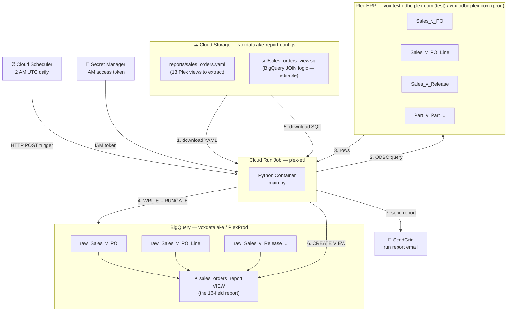
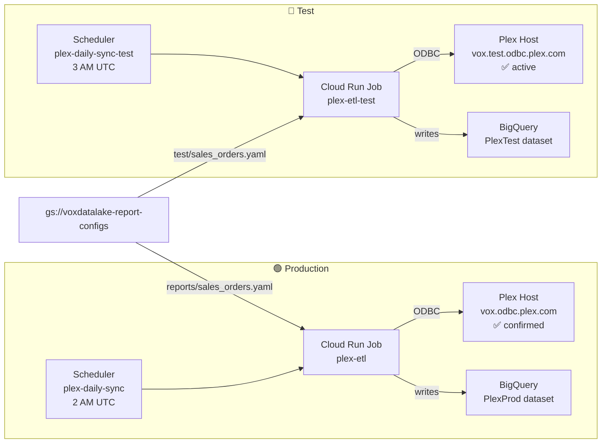
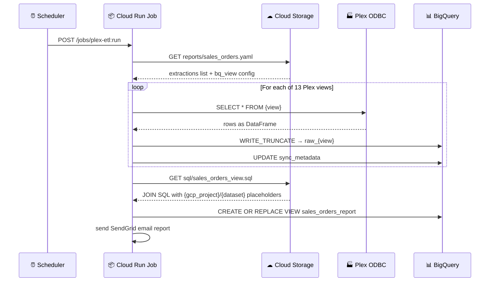

# Plex → BigQuery Pipeline — Cheatsheet

Quick reference for everything. No prior reading required.

---

## Mental Model (30 seconds)

This pipeline **copies Plex ERP data into BigQuery** so your data team can query it with SQL instead of clicking around in Plex.

- **Plex** stores your business data (orders, parts, customers) in tables called *views*
- **ODBC** is the wire — a standard database connector, same idea as JDBC in Java
- **Cloud Run** is the script runner — GCP's serverless container executor
- **BigQuery** is the data warehouse — think Google Sheets but for millions of rows and real SQL
- **Cloud Storage (GCS)** holds the report configuration files — edit them to change what gets extracted, no code deployment needed

The pipeline runs **automatically every night at 2 AM UTC**, or you can trigger it manually any time.

---

## System Architecture



---

## Environments: Prod vs Test



> **Failure retry:** all 4 jobs (sales + work orders, prod + test) also have
> a second scheduler firing daily at **6 AM `America/Denver`** that retries
> the same job if today's scheduled run genuinely FAILED (not PARTIAL). See
> [docs/OPERATIONS.md → Failure Retry](docs/OPERATIONS.md#failure-retry-6-am-mountain)
> for how it works and how to check `job_run_log`.

> **Both environments active.** Test (`plex-etl-test` → `vox.test.odbc.plex.com` → `PlexTest`) is validated with live data. Prod (`plex-etl` → `vox.odbc.plex.com` → `PlexProd`) is ready — trigger `plex-etl` for the first production run.

## Active Reports

| Report | Cloud Run Job (prod) | Cloud Run Job (test) | Schedule | Views extracted | BQ View(s) |
|---|---|---|---|---|---|
| **Sales Orders** | `plex-etl` | `plex-etl-test` | 2 AM / 3 AM UTC | 13 Sales + Part + Common + Plexus_Control | `sales_orders_report`, `sales_orders_open_report` |
| **Work Orders** | `plex-etl-work-orders` | `plex-etl-work-orders-test` | 4 AM / 5 AM UTC | 12 Part/Quality/Personnel/Common/Maintenance views | `work_orders_report`, `mfg_job_schedule_report` |
| **Purchasing Open Orders** | `plex-etl-purchasing-open-orders` | `-test` | 6 AM / 7 AM UTC | 6 Purchasing + Common + Part | `purchasing_open_orders_report` |
| **Part Obsolescence** | `plex-etl-part-obsolescence` | `-test` | 8 AM / 9 AM UTC | 1 Part_v_Part (filtered) | `part_obsolescence_report` |
| **Inventory Activity** | `plex-etl-inventory-activity` | `-test` | 10 AM / 11 AM UTC | 2 Part DB views (Cell_Production, Cell_Depletion) | `inventory_activity_report` |
| **Inventory Snapshot** | `plex-etl-inventory-snapshot` | `-test` | 12 PM / 1 PM UTC | 3 Part DB views (Snapshot, Snapshot_Cost_Sub_Type_Breakdown, Cost_Sub_Type_Breakdown_History) | `inventory_snapshot_report`, `inventory_valuation_summary_report` |
| **Quality Non-Conformance** | `plex-etl-quality-nonconformance` | `-test` | 2 PM / 3 PM UTC | 1 Quality_v_Problem + Part | `quality_nonconformance_report` |
| **Part On-Hand Inventory** | `plex-etl-part-on-hand-inventory` | `-test` | 4 PM / 5 PM UTC | 2 Part_v_Container(_Status) + Part | `part_on_hand_inventory_report` |

> `raw_Part_v_Part` is **shared** across several reports — owned by the Sales Orders pipeline (runs first); others reference it in their JOIN view without re-extracting it.
>
> The 4 NetSuite-parity reports above (added 2026-08-10/11, see
> [docs/NETSUITE_REPORT_BUILD_PLAN.md](NETSUITE_REPORT_BUILD_PLAN.md)) and the
> 3 MFG job-schedule reports (added 2026-08-11, see
> [docs/MFG_JOB_SCHEDULE_BUILD_PLAN.md](MFG_JOB_SCHEDULE_BUILD_PLAN.md)) all
> use the failure-retry pattern too — `-retry` schedulers exist for each,
> same as Sales/Work Orders.

---

## How the Multi-Report Config Works



**The key insight:** the YAML and SQL live in GCS, not in the container. Edit them in GCS → next run picks up the change automatically. No container rebuild, no Terraform apply.

---

## File Map

```
plex-to-big-query/
│
├── main.py                     ← ETL entry point (ODBC → BQ, reads GCS config)
├── email_utils.py              ← SendGrid email report builder
├── requirements.txt            ← Python deps (pinned)
├── Dockerfile                  ← Container: installs Plex ODBC driver + Python
├── docker-compose.yml          ← Local runner (writes CSVs to ./output/)
├── .env.example                ← Credential template — copy to .env
│
├── reports/                    ← REPORT DEFINITIONS — edit these to change what runs
│   ├── sales_orders.yaml       ← Prod report: 13 views → PlexProd
│   ├── work_orders.yaml        ← Prod report: 4 Part DB views → PlexProd (4 AM UTC)
│   ├── test/
│   │   ├── sales_orders.yaml   ← Test report: same views → PlexTest
│   │   └── work_orders.yaml    ← Test work orders → PlexTest (5 AM UTC)
│   └── sql/
│       ├── sales_orders_view.sql  ← BigQuery JOIN SQL for the 16-field report ✏
│       └── work_orders_view.sql   ← BigQuery JOIN SQL for work orders report ✏
│
├── config/
│   ├── odbc.ini                ← DSN definitions (PlexProduction / PlexTest)
│   └── odbcinst.ini            ← Registers the DataDirect ODBC driver
│
├── driver/                     ← Plex Linux ODBC driver (gitignored — copy manually)
│
├── terraform/
│   ├── main.tf                 ← All GCP infrastructure as code
│   ├── variables.tf            ← Terraform input variable definitions
│   ├── outputs.tf              ← Copy-paste commands after apply
│   └── terraform.tfvars        ← Your values (gitignored — copy from .example)
│
├── docs/                       ← Deep-dive documentation
│   ├── QUICKSTART.md
│   ├── FRONTEND_GUIDE.md
│   ├── OPERATIONS.md           ← How to add reports, configure SendGrid
│   ├── TROUBLESHOOTING.md
│   ├── API_REFERENCE.md
│   ├── TEARDOWN.md
│   ├── PLEX_REPORTS_CATALOG.md      ← Plex UI reports & data-sources catalog (vs. ODBC views)
│   ├── NETSUITE_REPORT_BUILD_PLAN.md ← NetSuite→Plex report migration plan
│   └── CODE_REVIEW_2026-07-14.md
│
├── catalog/                    ← Plex ODBC view catalogs (reference data)
│   ├── plex_catalog_index.md   ← Master index — start here
│   └── plex_*_views_catalog.md ← One per Plex database (Sales, Part, ...)
│
├── mapping/                     ← Plex UI report catalog + data-sources catalog (reference data)
│   ├── available-reports.*     ← All 1,153 Plex UI reports (md/csv/json)
│   ├── enabled-reports.*       ← 152 reports enabled for this tenant
│   ├── data-sources*.*         ← 14,350 CustomerDataSourceManager stored procs (+ accessible shortlist)
│   └── netsuite-report-mapping.md ← NetSuite saved-search → Plex report mapping (first pass)
│
└── spreadsheets/                ← Human-maintained Google Sheets → BigQuery report catalog
    ├── SPREADSHEET_CATALOG.md   ← Hub — start here
    └── *.md                     ← One per spreadsheet: findings, gaps, Plex references
```

---

## Environment Variables — Complete Reference

### Runtime (read by `main.py`)

| Variable | Where set | Default | What it does |
|---|---|---|---|
| `OUTPUT_MODE` | `.env` / docker-compose | `bigquery` | `local` writes CSVs; `bigquery` writes to BQ |
| `GCP_PROJECT` | Cloud Run env | — | GCP project ID (`voxdatalake`) |
| `BQ_DATASET` | Cloud Run env | — | BigQuery dataset (`PlexProd` or `PlexTest`) |
| `BQ_TABLE` | Cloud Run env | `plex_extract` | Fallback table name (used in legacy single-view mode) |
| `REPORT_CONFIG_GCS_PATH` | Cloud Run env | `""` | GCS URI of the report YAML — **this is the new key variable** |
| `PLEX_VIEW` | Cloud Run env | `Part_v_Part` | Legacy: single Plex view name (ignored when REPORT_CONFIG_GCS_PATH is set) |
| `PLEX_FILTER` | Cloud Run env | — | Legacy: SQL WHERE clause |
| `PLEX_DATE_COL` | Cloud Run env | `""` | Legacy: column for incremental sync |
| `PLEX_HOST` | Cloud Run env | — | Plex ODBC hostname |
| `PLEX_PORT` | Cloud Run env | `19995` | Plex ODBC port |
| `PLEX_SERVER_DATASOURCE` | Cloud Run env | `ReportDataSource` | Plex data source name |
| `PLEX_DSN` | Cloud Run env | `PlexProduction` | ODBC DSN name (fallback auth only) |
| `PLEX_ODBC_USER` | Cloud Run env | — | Plex login (`edominguez.parasol`) |
| `PLEX_ACCESS_TOKEN` | `.env` only | `""` | Direct IAM token (local testing) |
| `METADATA_TABLE` | Cloud Run env | `sync_metadata` | BQ table tracking sync state |
| `BACKFILL_MINUTES` | Cloud Run env | `5` | Lookback window for incremental tables |

### Email (SendGrid)

| Variable | Purpose |
|---|---|
| `SENDGRID_ENABLED` | `"true"` or `"false"` |
| `REPORT_FROM_EMAIL` | Verified sender address |
| `REPORT_TO_EMAILS` | Comma-separated recipient list |
| `REPORT_SUBJECT` | Email subject (auto-generated if empty) |
| `COMPANY_NAME` | Appears in subject line |

### Secret Manager References (these are **names**, not actual values)

| Variable | Secret name | Contains |
|---|---|---|
| `SECRET_ACCESS_TOKEN` | `plex-access-token` | Plex IAM bearer token |
| `SECRET_ODBC_USER` | `plex-odbc-user` | Plex username (fallback) |
| `SECRET_ODBC_PASSWORD` | `plex-odbc-password` | Plex password (fallback) |
| `SECRET_COMPANY_CODE` | `plex-company-code` | Plex company code (fallback) |
| `SECRET_SENDGRID_KEY` | `sendgrid-api-key` | SendGrid API key |

---

## Quick Commands

### Deploy (after any code change)

```bash
# Preferred: Cloud Build — builds, pushes, updates both jobs, and smoke-tests
# the TEST job only (production is never executed automatically)
gcloud builds submit --config deploy/cloudbuild.yaml --project=voxdatalake \
  --substitutions=SHORT_SHA=$(git rev-parse --short HEAD)

# Manual alternative: build and push locally
docker build -t us-central1-docker.pkg.dev/voxdatalake/plex-pipeline/etl:latest .
docker push us-central1-docker.pkg.dev/voxdatalake/plex-pipeline/etl:latest

# Apply Terraform changes (new env vars, infrastructure)
cd terraform
terraform apply -var-file=terraform.tfvars
```

### Run the job manually (test environment)

```bash
# Trigger the test job and wait for it to finish
gcloud run jobs execute plex-etl-test \
  --region=us-central1 --project=voxdatalake --wait

# Watch live logs as it runs
gcloud logging read \
  "resource.type=cloud_run_job AND resource.labels.job_name=plex-etl-test" \
  --project=voxdatalake --limit=50 --freshness=10m --format="value(textPayload)"
```

### Edit a report query (no deployment needed)

```bash
# 1. Edit the YAML to change filters, add/remove a view
#    (edit reports/sales_orders.yaml locally, then push to GCS)
gcloud storage cp reports/sales_orders.yaml \
  gs://voxdatalake-report-configs/reports/

# 2. Edit the BigQuery JOIN SQL
gcloud storage cp reports/sql/sales_orders_view.sql \
  gs://voxdatalake-report-configs/sql/

# 3. Trigger a run to pick up the changes
gcloud run jobs execute plex-etl-test \
  --region=us-central1 --project=voxdatalake --wait
```

Or edit files directly in the [Cloud Storage Console](https://console.cloud.google.com/storage/browser/voxdatalake-report-configs) — no CLI required.

### Run the work orders job manually

```bash
# Test
gcloud run jobs execute plex-etl-work-orders-test \
  --region=us-central1 --project=voxdatalake --wait

# Prod
gcloud run jobs execute plex-etl-work-orders \
  --region=us-central1 --project=voxdatalake --wait
```

### Edit work orders report (no deployment needed)

```bash
# Push updated YAML or SQL to GCS — next run picks it up automatically
gcloud storage cp reports/work_orders.yaml \
  gs://voxdatalake-report-configs/reports/

gcloud storage cp reports/sql/work_orders_view.sql \
  gs://voxdatalake-report-configs/sql/
```

### Check BigQuery results

> **Windows Git Bash:** `bq` fails with `python3.12: command not found`.
> Use `bq.cmd` instead — or paste the query directly in the [BigQuery Console](https://console.cloud.google.com/bigquery).

```bash
# Row count per raw table
bq.cmd query --project_id=voxdatalake --nouse_legacy_sql \
  "SELECT 'raw_Sales_v_PO' AS tbl, COUNT(*) AS rows FROM \`voxdatalake.PlexTest.raw_Sales_v_PO\`"

# Preview the 16-field sales orders view
bq.cmd query --project_id=voxdatalake --nouse_legacy_sql \
  "SELECT * FROM \`voxdatalake.PlexTest.sales_orders_report\` LIMIT 10"

# Preview the work orders view
bq.cmd query --project_id=voxdatalake --nouse_legacy_sql \
  "SELECT * FROM \`voxdatalake.PlexTest.work_orders_report\` LIMIT 10"

# Last sync metadata
bq.cmd query --project_id=voxdatalake --nouse_legacy_sql \
  "SELECT table_name, synced_at, rows_written FROM \`voxdatalake.PlexTest.sync_metadata\` ORDER BY synced_at DESC LIMIT 20"
```

### Secrets management

```bash
# Store or replace the Plex IAM token
# Note: this token does not expire — only replace if you generate a new one in Plex
echo -n 'your-token-here' | \
  gcloud secrets versions add plex-access-token \
  --data-file=- --project=voxdatalake

# Read back a secret to verify it's stored
gcloud secrets versions access latest \
  --secret=plex-access-token --project=voxdatalake
```

---

## How to Add a New Report

> **Full guide with SAFE_CAST patterns, shared table rules, and step-by-step Plex view discovery:** [docs/OPERATIONS.md](docs/OPERATIONS.md#add-a-brand-new-report)

Quick version — no container rebuild needed. Only one `terraform apply` required.

### Step 1 — Create the YAML (prod + test)

```bash
cp reports/work_orders.yaml reports/purchasing_orders.yaml
cp reports/test/work_orders.yaml reports/test/purchasing_orders.yaml
# Edit both: change report_name, extractions list, bq_view name
```

### Step 2 — Write the BigQuery SQL

```bash
cp reports/sql/work_orders_view.sql reports/sql/purchasing_orders_view.sql
# Edit JOIN logic. Always use {gcp_project} and {dataset} placeholders.
# Wrap numeric JOIN keys and aggregated columns in SAFE_CAST — see work_orders_view.sql.
```

### Step 3 — Upload to GCS

```bash
gcloud storage cp reports/purchasing_orders.yaml gs://voxdatalake-report-configs/reports/ --project=voxdatalake
gcloud storage cp reports/test/purchasing_orders.yaml gs://voxdatalake-report-configs/test/ --project=voxdatalake
gcloud storage cp reports/sql/purchasing_orders_view.sql gs://voxdatalake-report-configs/sql/ --project=voxdatalake
```

### Step 4 — Add Cloud Run Jobs in `terraform/main.tf`

Copy the `etl_work_orders` + `etl_work_orders_test` blocks. Change job name, `REPORT_CONFIG_GCS_PATH`, `BQ_DATASET`, `PLEX_HOST`, and schedule. `BQ_TABLE` and `PLEX_VIEW` are **not needed** for multi-report jobs.

```hcl
resource "google_cloud_run_v2_job" "etl_purchasing" {
  name     = "plex-etl-purchasing"
  location = var.gcp_region
  template {
    template {
      service_account = google_service_account.etl.email
      max_retries     = 1
      timeout         = "600s"
      containers {
        image = var.image_url
        env { name = "GCP_PROJECT";            value = var.gcp_project }
        env { name = "BQ_DATASET";             value = var.bq_dataset }
        env { name = "PLEX_HOST";              value = var.plex_host }
        env { name = "PLEX_PORT";              value = "19995" }
        env { name = "PLEX_SERVER_DATASOURCE"; value = "ReportDataSource" }
        env { name = "REPORT_CONFIG_GCS_PATH"
              value = "gs://${var.report_configs_bucket}/reports/purchasing_orders.yaml" }
        env { name = "METADATA_TABLE";         value = var.metadata_table }
        env { name = "SENDGRID_ENABLED";       value = var.sendgrid_enabled }
        env { name = "REPORT_FROM_EMAIL";      value = var.report_from_email }
        env { name = "REPORT_TO_EMAILS";       value = var.report_to_emails }
        env { name = "SECRET_SENDGRID_KEY";    value = var.secret_sendgrid_key }
        env { name = "SECRET_ACCESS_TOKEN";    value = var.secret_access_token }
        env { name = "COMPANY_NAME";           value = var.company_name }
        env { name = "REPORT_SUBJECT";         value = var.report_subject }
      }
    }
  }
}

resource "google_cloud_scheduler_job" "etl_purchasing" {
  name      = "plex-purchasing-sync"
  schedule  = "0 6 * * *"
  time_zone = "UTC"
  region    = var.gcp_region
  http_target {
    http_method = "POST"
    uri         = "https://run.googleapis.com/v2/projects/${var.gcp_project}/locations/${var.gcp_region}/jobs/${google_cloud_run_v2_job.etl_purchasing.name}:run"
    body        = base64encode("{}")
    oauth_token { service_account_email = google_service_account.etl.email }
  }
}
```

### Step 5 — Apply

```bash
cd terraform && terraform apply -var-file=terraform.tfvars
```

Future query changes (YAML or SQL) go through GCS only — no rebuild, no `terraform apply`.

---

## Plex View Naming Convention

**Rule:** `{Database}_v_{ViewName}` — the SQL Dev tree shows only `ViewName`; always add the database prefix when querying.

| What you see in SQL Dev | What you query via ODBC | Database |
|---|---|---|
| `PO` | `Sales_v_PO` | Sales |
| `PO_Line` | `Sales_v_PO_Line` | Sales |
| `Order_Salesperson` | `Sales_v_Order_Salesperson` | Sales |
| `Release` | `Sales_v_Release` | Sales |
| `PO_Status` | `Sales_v_PO_Status` | Sales |
| `Customer` | `Common_v_Customer` | Common |
| `Part` | `Part_v_Part` | Part |
| `Customer_Part_Price` | `Part_v_Customer_Part_Price` | Part |
| `Part_Product_Type` | `Part_v_Part_Product_Type` | Part |
| `Plexus_User` | `Plexus_Control_v_Plexus_User` | Plexus_Control |
| `PO` (purchasing) | `Purchasing_v_PO` | Purchasing |
| `Employee` | `Personnel_v_Employee` | Personnel |

To discover view names: open **Plex SQL Dev** → expand the database tree → right-click any view → `{Database}_v_{NodeName}`.

---

## GCP Services — What Each One Does Here

| GCP Service | What it is (in general) | What it does in this pipeline |
|---|---|---|
| **Cloud Run Jobs** | Serverless container executor — run a Docker container on demand, pay per second | Runs `main.py` — queries Plex, loads BigQuery |
| **Cloud Scheduler** | Managed cron — fires HTTP requests on a schedule | Triggers the Cloud Run Job at 2 AM UTC every night |
| **BigQuery** | Serverless data warehouse — query terabytes with SQL, pay per query | Stores all raw Plex tables + the JOIN view your data team queries |
| **Cloud Storage (GCS)** | Object storage — like S3, stores files | Holds the YAML report configs and SQL view definitions |
| **Secret Manager** | Encrypted secret store | Stores the Plex IAM token and SendGrid API key |
| **Artifact Registry** | Docker image registry — like Docker Hub but in GCP | Stores the container image that Cloud Run pulls |
| **IAM / Service Accounts** | Identity and access management | The Cloud Run Job runs as `plex-etl-sa@voxdatalake.iam.gserviceaccount.com`, which has only the permissions it needs |

### Key IAM roles the service account holds

| Role | Why it's needed |
|---|---|
| `roles/bigquery.dataEditor` | Write rows to BigQuery tables |
| `roles/bigquery.jobUser` | Run BigQuery load jobs |
| `roles/secretmanager.secretAccessor` | Read the Plex IAM token from Secret Manager |
| `roles/artifactregistry.reader` | Pull the Docker image |
| `roles/storage.objectViewer` | Read the YAML/SQL report configs from GCS |
| `roles/run.invoker` | Cloud Scheduler calls the Cloud Run job |

### GCP Console quick links

| What | URL |
|---|---|
| Cloud Run Jobs | `console.cloud.google.com/run/jobs?project=voxdatalake` |
| BigQuery | `console.cloud.google.com/bigquery?project=voxdatalake` |
| Cloud Storage | `console.cloud.google.com/storage?project=voxdatalake` |
| Secret Manager | `console.cloud.google.com/security/secret-manager?project=voxdatalake` |
| Cloud Scheduler | `console.cloud.google.com/cloudscheduler?project=voxdatalake` |
| Job logs | `console.cloud.google.com/logs?project=voxdatalake` |

---

## Troubleshooting Quick Fixes

### ODBC: `[08001] [DataDirect]` or connection refused

```bash
# Confirm the host and port are correct:
#   Test:  PLEX_HOST=vox.test.odbc.plex.com  PORT=19995  ✅
#   Prod:  PLEX_HOST=vox.odbc.plex.com        PORT=19995  ✅
# ServerDataSource must be exactly: ReportDataSource
```

### ODBC: `HY000 10300` — access token invalid

```bash
# The IAM token in Secret Manager is wrong or was overwritten.
# The Plex IAM token does NOT expire — it only breaks if replaced with the wrong value.
# To verify what's stored:
gcloud secrets versions access latest --secret=plex-access-token --project=voxdatalake
# To replace it with the correct Plex token:
echo -n 'PLEX_TOKEN_HERE' | gcloud secrets versions add plex-access-token \
  --data-file=- --project=voxdatalake
```

### ODBC: `HY000 3059` — DSN not found

```bash
# The code accidentally used DSN-based auth instead of driver-direct.
# Fix: ensure PLEX_ACCESS_TOKEN (or SECRET_ACCESS_TOKEN) is set.
# The IAM token path uses driver-direct; only username/password auth uses the DSN.
```

### `View not found: {ViewName}`

```bash
# You're missing the {Database}_v_ prefix.
# Wrong:  PO
# Right:  Sales_v_PO
# Check the reports/sales_orders.yaml plex_view field.
```

### BigQuery: `403 Access Denied`

```bash
# The service account is missing a BigQuery IAM role.
gcloud projects add-iam-policy-binding voxdatalake \
  --member="serviceAccount:plex-etl-sa@voxdatalake.iam.gserviceaccount.com" \
  --role="roles/bigquery.dataEditor"
```

### GCS: `403` when loading report config

```bash
# The service account is missing storage.objectViewer on the bucket.
gcloud storage buckets add-iam-policy-binding gs://voxdatalake-report-configs \
  --member="serviceAccount:plex-etl-sa@voxdatalake.iam.gserviceaccount.com" \
  --role="roles/storage.objectViewer"
```

### `Secret Manager: permission denied`

```bash
gcloud projects add-iam-policy-binding voxdatalake \
  --member="serviceAccount:plex-etl-sa@voxdatalake.iam.gserviceaccount.com" \
  --role="roles/secretmanager.secretAccessor"
```

### Job exits with 0 rows extracted

```bash
# Check if the Plex view is empty, or the filter is too restrictive.
# NOTE: a 0-row response does NOT clear the BigQuery table — existing data
# is preserved and a warning is logged (safety guard added 2026-07-14).
# Run the job in local mode against the test host:
docker run --env-file .env \
  -e OUTPUT_MODE=local \
  -e PLEX_VIEW=Sales_v_PO \
  -e PLEX_FILTER="" \
  -v "$(pwd)/output:/output" \
  us-central1-docker.pkg.dev/voxdatalake/plex-pipeline/etl:latest
```

### Report view shows dates as huge numbers (e.g. `1750118400000000000`)

```sql
-- Plex dates land in the raw tables as INT64 *nanoseconds*.
-- The view SQL converts them with this pattern. Two BigQuery gotchas baked in:
--   * DIV, not "/" — TIMESTAMP_MICROS requires INT64; "/" returns FLOAT64
--   * every branch routes through CAST(col AS STRING) — a direct
--     SAFE_CAST(INT64 AS DATE) is an invalid cast PAIR and fails at
--     compile time even inside SAFE_CAST
COALESCE(
  DATE(TIMESTAMP_MICROS(DIV(NULLIF(SAFE_CAST(CAST(col AS STRING) AS INT64), 0), 1000))),
  NULLIF(SAFE_CAST(CAST(col AS STRING) AS DATE), DATE '1970-01-01'),
  NULLIF(DATE(SAFE_CAST(CAST(col AS STRING) AS TIMESTAMP)), DATE '1970-01-01')
) AS my_date
-- If dates are STILL numbers after editing the SQL: push the .sql to GCS
-- AND re-run the job — the view is only recreated during a pipeline run.
-- A view-SQL compile error shows up as a PARTIAL email with the BigQuery
-- error message and [line:column] pointing into the substituted SQL.
```

### Terraform plan shows changes you didn't intend

```bash
# Most common cause: a GCS bucket object was edited in the Console.
# Terraform will re-upload from the local file on next apply.
# Before applying: review the plan output carefully.
terraform plan -var-file=terraform.tfvars
```

### Full job log review

```bash
# Get the last 100 log lines from the most recent test job execution
gcloud logging read \
  'resource.type="cloud_run_job" AND resource.labels.job_name="plex-etl-test"' \
  --project=voxdatalake --limit=100 \
  --format='value(textPayload)' \
  --freshness=1d
```

---

## Sales Orders Report — 16-Field Mapping

The current report extracts these 13 Plex views to produce 16 output columns:

| Field | Source | View | Join key |
|---|---|---|---|
| `document_so` | `PO_No` | `Sales_v_PO` | — (header) |
| `date_created` | `PO_Date` | `Sales_v_PO` | — |
| `date_approved` | `MIN(Change_Date)` WHERE `PO_Status_Key=2073` | `Sales_v_PO_Change` | `PO_Key` |
| `order_type` | `PO_Type` | `Sales_v_PO_Type` | `PO_Type_Key` |
| `from_quote` | `From_PO_Key IS NOT NULL` | `Sales_v_PO` | — |
| `status` | `PO_Status` | `Sales_v_PO_Status` | `PO_Status_Key` |
| `customer_name` | `Name` | `Common_v_Customer` | `Customer_No` |
| `sales_rep_1` | `First_Name + Last_Name` | `Plexus_Control_v_Plexus_User` | `Sales_v_Order_Salesperson` Sort_Order=1 |
| `sales_rep_2` | Same | Same | Sort_Order=2 |
| `part_number` | `Part_No` | `Part_v_Part` | `Sales_v_PO_Line.Part_Key` |
| `qty_ordered` | `Quantity` | `Sales_v_Release` | `PO_Line_Key` |
| `price_ea` | `Price` (base tier) | `Part_v_Customer_Part_Price` | `Customer_Part_Key` |
| `price_total` | `Price × Quantity` | computed | — |
| `order_total` | `Master_Price` | `Sales_v_PO` | — |
| `product_type` | `Part_Product_Type` | `Part_v_Part_Product_Type` | `Part_Product_Type_Key` |
| `product_group` | `Part_Product_Group` | `Part_v_Part_Product_Group` | `Part_Product_Group_Key` |

**Status workflow (Vox Nutrition):**
`2585` Pending Sales Approval → `2587` Deposit Review → `2586` Released → **`2073` Pending Fulfillment** (= Date Approved) → `2638` Pending Payment Review → `2639` Pending Shipment → `2074` Closed / `2076` Cancelled
